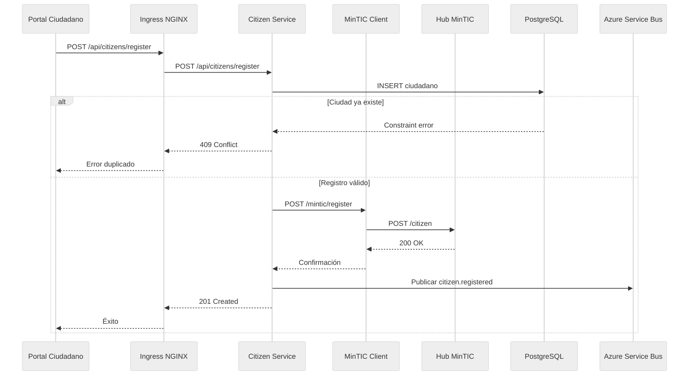
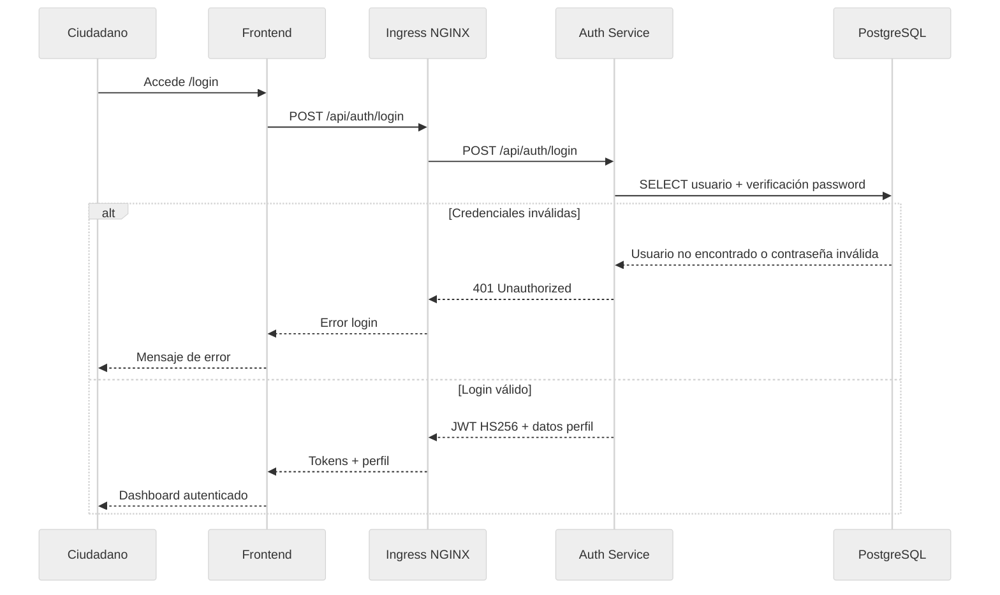
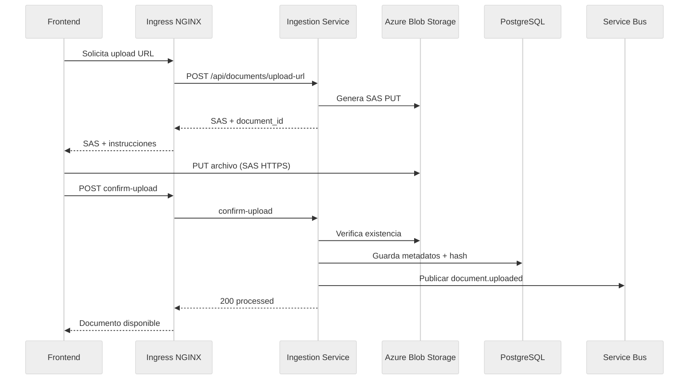
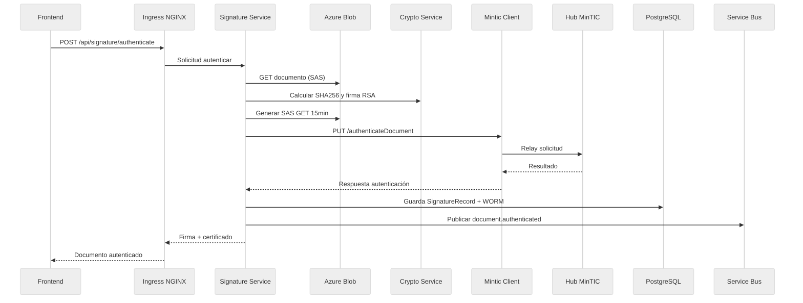
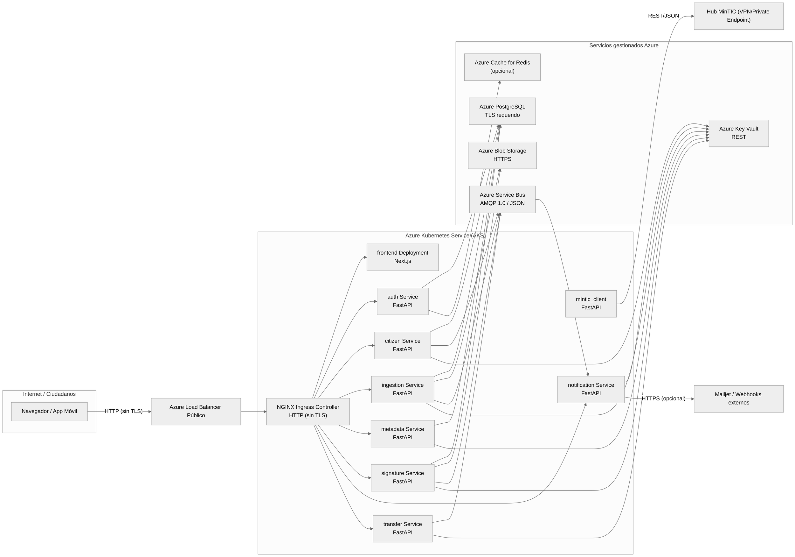

# Arquitectura de Carpeta Ciudadana

## 0. Estado Actual (noviembre 2025)

- **Exposición HTTP**: `frontend` se publica con un `Service` tipo LoadBalancer y un `Ingress` NGINX sin TLS; no hay Azure Front Door ni gateway dedicado en este entorno.
- **Autenticación**: el servicio `auth` gestiona registro/login con base de datos propia y emite JWT HS256; la integración con Azure AD B2C está deshabilitada.
- **Persistencia**: Azure PostgreSQL Flexible Server y Azure Blob Storage están habilitados; Redis y Service Bus se inyectan vía secretos pero se operan en modo mínimo.
- **Servicios activos**: `frontend`, `auth`, `citizen`, `ingestion`, `metadata`, `signature`, `transfer`, `notification` y `mintic_client` se despliegan con 1 réplica y sin autoscaling.
- **Migrations/DevOps**: los `jobs` de migraciones Alembic están desactivados (`migrations.enabled = false`); se requiere ejecución manual antes de releases.
- **Seguridad y observabilidad**: TLS, headers HSTS/CSP, OpenTelemetry y cert-manager permanecen apagados. Las políticas de red están habilitadas con denegación por defecto.
- **Notificaciones**: `notification` se despliega, pero el envío real depende de que existan secretos válidos de Mailjet; por defecto opera en modo “solo registrar eventos”.

## 1. Contexto y Objetivos

El ecosistema **Carpeta Ciudadana** permite a los ciudadanos colombianos administrar documentos personales digitales y acceder a servicios estatales a través de operadores certificados. La solución está compuesta por microservicios desplegados en Azure Kubernetes Service (AKS) y sigue patrones event-driven con alta seguridad y cumplimiento.

**Objetivos clave**
- Centralizar la gestión de identidad y documentos ciudadanos.
- Garantizar autenticación robusta, trazabilidad y auditoría end-to-end.
- Permitir interoperabilidad con el Hub MinTIC y sistemas externos.
- Escalar horizontalmente en la nube manteniendo costos controlados.

**Actores**
- `Ciudadano`: usuario final que gestiona su carpeta.
- `Operador`: entidad autorizada que ofrece la Carpeta Ciudadana.
- `Administración MinTIC`: gobierno que valida identidad y documentos.
- `Sistemas Externos`: integraciones (notificaciones, analítica, etc.).

## 2. Casos de Uso Clave

### 2.1 Diagrama de Casos de Uso

```mermaid
%%{init: {'theme': 'neutral'}}%%
usecaseDiagram
title Casos de uso Carpeta Ciudadana
actor Ciudadano
actor Operador
actor Hub as "Hub MinTIC"
actor Ext as "Servicios Externos"

Ciudadano --> (CU1 Registrar ciudadano)
Operador --> (CU1 Registrar ciudadano)

Ciudadano --> (CU2 Autenticarse en operador)
Operador --> (CU2 Autenticarse en operador)

Ciudadano --> (CU3 Cargar documentos)
Operador --> (CU3 Cargar documentos)

Ciudadano --> (CU4 Autenticar documento vía Gov)
Operador --> (CU4 Autenticar documento vía Gov)
Hub --> (CU4 Autenticar documento vía Gov)

Ext --> (CU5 Recibir notificaciones de eventos)
Operador --> (CU5 Recibir notificaciones de eventos)
```

### 2.2 Especificaciones de Casos de Uso

**CU1 Registrar ciudadano**
- **Actor primario:** Operador (con asistencia del ciudadano).
- **Stakeholders:** Ciudadano, Administrador MinTIC, Auditoría.
- **Precondiciones:** Operador autenticado; ciudadano no registrado previamente.
- **Postcondiciones:** Ciudadano creado en `citizen` (PostgreSQL), sincronizado con Hub MinTIC, evento `citizen.registered` publicado.
- **Flujo principal:**
  1. Operador captura datos del ciudadano desde el portal.
  2. Frontend invoca `citizen` (`POST /api/citizens/register`) mediante el `Ingress` NGINX.
  3. `citizen` valida datos y consulta duplicados.
  4. `citizen` registra ciudadano localmente y llama a `mintic_client`.
  5. `mintic_client` registra ciudadano en Hub MinTIC.
  6. `citizen` confirma registro, publica evento en Service Bus y retorna éxito.
- **Flujos alternos:**
  - A1: Hub MinTIC rechaza registro → rollback local, mensaje de error según código.
  - A2: Ciudadano ya existe → responde `409 Conflict`.
- **Reglas de negocio:** ID único de 10 dígitos; correo verificado; sincronización con Hub obligatoria.

**CU2 Autenticarse en el operador**
- **Actor primario:** Ciudadano.
- **Precondiciones:** Cuenta creada en el servicio `auth`; operador activo.
- **Postcondiciones:** Sesión válida en Frontend; token JWT HS256 emitido por `auth`; sesión registrada en PostgreSQL/Redis.
- **Flujo principal:**
  1. Ciudadano navega al portal e inicia login (OIDC).
  2. Frontend llama a `auth` (`POST /api/auth/login`) vía Ingress.
  3. `auth` valida credenciales contra su base PostgreSQL.
  4. `auth` genera JWT HS256 y sesión; retorna tokens al frontend.
  5. Frontend almacena sesión (NextAuth) y habilita menú del ciudadano.
- **Flujos alternos:** Credenciales inválidas → `auth` retorna `401`; usuario bloqueado → estado `is_active = false`.
- **Reglas:** Sesiones expiran a las 24h; revocación inmediata en logout.

**CU3 Cargar documentos**
- **Actor primario:** Ciudadano.
- **Precondiciones:** Ciudadano autenticado; cuota de almacenamiento disponible.
- **Postcondiciones:** Documento almacenado en Azure Blob Storage, metadatos registrados en `ingestion` y `metadata`, evento `document.uploaded` publicado.
- **Flujo principal:**
  1. Ciudadano solicita carga; frontend llama a `ingestion` para SAS de upload.
  2. `ingestion` valida permisos, genera SAS URL PUT (HTTPS).
  3. Ciudadano sube archivo directamente al Blob Storage.
  4. Frontend confirma upload (`POST /api/documents/confirm-upload`).
  5. `ingestion` valida blob, calcula hash, guarda metadatos y emite evento.
- **Flujos alternos:** Archivo no permitido → `413/415`; error al subir → reintento con nueva SAS.
- **Reglas:** Tamaño máx 50 MB; tipos MIME permitidos; WORM activado al firmar.

**CU4 Autenticar documentos via Gov**
- **Actor primario:** Ciudadano.
- **Stakeholders:** Hub MinTIC, Auditoría.
- **Precondiciones:** Documento existente y sin autenticación previa; ciudadano autenticado.
- **Postcondiciones:** Registro `SignatureRecord` creado, documento marcado WORM y autenticado en Hub MinTIC, evento `document.hubAuthenticated`.
- **Flujo principal:**
  1. Ciudadano solicita autenticación; frontend llama `signature`.
  2. `signature` obtiene documento (SAS GET), calcula hash y firma (RSA-SHA256).
  3. Genera SAS temporal y envía `PUT` al Hub MinTIC vía `mintic_client`.
  4. Hub confirma autenticación; `signature` persiste resultado y bloquea documento (WORM).
  5. Respuesta con certificado y URL firmada al frontend.
- **Flujos alternos:** Hub indisponible → reintento exponencial, estado `PENDING_HUB`; validación fallida → documento marcado como `FAILED_AUTH`.
- **Reglas:** Retención mínima 5 años; registros inmutables.

### 2.3 Historias de Usuario + Scenario (Gherkin-like)

**HU1 - Registro de ciudadano**
- **Como** operador certificado  
- **Quiero** registrar un ciudadano en la Carpeta  
- **Para** habilitarle todos los servicios digitales

_Scenario: Registro exitoso_
1. Ana inicia sesión en el portal operador.
2. Desde `Ciudadanos` selecciona `Registrar`.
3. Ingresa cédula, correo y datos básicos.
4. El portal invoca el servicio `citizen`.
5. El sistema verifica que la cédula no existe.
6. Se crea el registro local y se sincroniza con Hub MinTIC.
7. El sistema devuelve confirmación y notificación.
8. Ana recibe mensaje “Registro exitoso”.

**HU2 - Autenticación de ciudadano**
- **Como** ciudadano registrado  
- **Quiero** autenticarme en el operador  
- **Para** gestionar mis documentos

_Scenario: Autenticación con MFA habilitado_
1. Luis ingresa a `carpeta-ciudadana.gov.co`.
2. Presiona `Iniciar sesión`.
3. El frontend muestra el formulario local y envía usuario/contraseña a `auth`.
4. `auth` valida la contraseña y genera JWT HS256 (MFA no disponible en este entorno).
5. El frontend registra la sesión y persiste las cookies.
6. Luis accede al dashboard personal.

**HU3 - Carga de documentos**
- **Como** ciudadano autenticado  
- **Quiero** subir documentos personales  
- **Para** mantener mi carpeta actualizada

_Scenario: Upload con validación de tipo_
1. Marta selecciona `Agregar documento`.
2. El sistema pide tipo de documento y archivo.
3. Marta selecciona `PDF`.
4. Frontend solicita SAS de upload a `ingestion`.
5. `ingestion` devuelve URL prefirmada.
6. Marta sube el archivo directo al blob.
7. Frontend confirma carga.
8. `ingestion` valida hash y responde `processed`.

**HU4 - Autenticación gubernamental de documentos**
- **Como** ciudadano  
- **Quiero** autenticar un documento ante MinTIC  
- **Para** garantizar su validez legal

_Scenario: Autenticación exitosa_
1. Carlos abre su documento firmado pendiente.
2. Clic en `Autenticar en Gov`.
3. Frontend envía petición a `signature`.
4. `signature` firma digitalmente y genera SAS para Hub.
5. `mintic_client` invoca `PUT /authenticateDocument`.
6. Hub retorna `200 OK` con referencia.
7. `signature` marca documento como `SIGNED` y WORM.
8. Carlos descarga el certificado oficial.

## 3. Arquitectura de Componentes

### 3.1 Componentes Lógicos (dominio)

```mermaid
%%{init: {'theme': 'neutral', 'flowchart': {'useMaxWidth': false}}}%%
flowchart LR
  subgraph ExperienciaUsuario
    UI[Portal Ciudadano\n(Next.js)]
    Ingress[Ingress NGINX\nRouting HTTP]
  end
  subgraph GestionIdentidad
    Auth[Auth Service\nOIDC local + JWT]
    Citizen[Citizen Service\nGestión de perfiles]
  end
  subgraph GestionDocumental
    Ingestion[Document Ingestion\nSAS, Metadatos]
    Metadata[Metadata Service\nCatálogo documentos]
    Signature[Signature Service\nFirma & WORM]
  end
  subgraph Integraciones
    Mintic[MinTIC Client\nProxy oficial]
    Notification[Notification Service\nEventos → Mailjet]
    Transfer[Transfer Service\nSagas/Compensaciones]
  end
  EventBus[(Azure Service Bus\nEventos)]
  UI -->|HTTP| Ingress
  Ingress --> Auth
  Ingress --> Citizen
  Ingress --> Ingestion
  Ingress --> Signature
  Ingress --> Transfer
  Ingress --> Notification
  Ingestion --> Metadata
  Signature --> Metadata
  Signature --> Mintic
  Citizen --> Mintic
  Citizen --> EventBus
  Ingestion --> EventBus
  Signature --> EventBus
  Transfer --> EventBus
  EventBus --> Notification
```

### 3.2 Componentes Técnicos (microservicios y data stores)

```mermaid
%%{init: {'theme': 'neutral'}}%%
graph TD
  Browser["Usuarios / Operadores"]
  subgraph AKS["Azure Kubernetes Service"]
    IngressNGINX["NGINX Ingress\nHTTP (sin TLS)"]
    Frontend["frontend (Next.js)"]
    AuthMS["auth (FastAPI)"]
    CitizenMS["citizen (FastAPI)"]
    IngestionMS["ingestion (FastAPI)"]
    MetadataMS["metadata (FastAPI)"]
    SignatureMS["signature (FastAPI + Crypto)"]
    MinticMS["mintic_client (FastAPI)"]
    NotificationMS["notification (FastAPI)"]
    TransferMS["transfer (FastAPI)"]
    CommonLib[":common library (Python utils)"]
  end

  PostgreSQL[(Azure PostgreSQL Flexible Server)]
  Blob[(Azure Blob Storage)]
  ServiceBus[(Azure Service Bus)]
  KeyVault[(Azure Key Vault)]
  Redis[(Azure Cache for Redis\n(opcional))]
  MinTIC[(Hub MinTIC API)]

  Browser --> IngressNGINX
  IngressNGINX --> Frontend
  IngressNGINX --> AuthMS
  IngressNGINX --> CitizenMS
  IngressNGINX --> IngestionMS
  IngressNGINX --> SignatureMS
  IngressNGINX --> MetadataMS
  IngressNGINX --> NotificationMS
  IngressNGINX --> TransferMS
  CitizenMS --> PostgreSQL
  AuthMS --> PostgreSQL
  MetadataMS --> PostgreSQL
  SignatureMS --> PostgreSQL
  IngestionMS --> PostgreSQL
  IngestionMS --> Blob
  SignatureMS --> Blob
  CitizenMS --> ServiceBus
  IngestionMS --> ServiceBus
  SignatureMS --> ServiceBus
  TransferMS --> ServiceBus
  ServiceBus --> NotificationMS
  AuthMS --> Redis
  CitizenMS --> KeyVault
  IngestionMS --> KeyVault
  SignatureMS --> KeyVault
  MetadataMS --> KeyVault
  NotificationMS --> KeyVault
  TransferMS --> KeyVault
  SignatureMS --> MinticMS
  MinticMS --> MinTIC
```

## 4. Diagramas de Secuencia de Operaciones

### 4.1 Registro de ciudadano (CU1)



### 4.2 Autenticación (CU2)



### 4.3 Carga de documentos (CU3)



### 4.4 Autenticación Gov (CU4)



## 5. Diagrama de Despliegue



**Protocolos y formatos**
- Frontera externa (estado actual): `HTTP` sin TLS (cert-manager y certificados deshabilitados). Requiere túnel seguro externo si se expone a producción.
- Mensajería interna: `AMQP 1.0` (Service Bus), `JSON` eventos.
- Persistencia: `PostgreSQL` (SQL, JSONB), `Redis` (Key/Value), `Blob` (binario + metadata).
- Secrets: `CSI driver` monta desde `Key Vault`.

## 6. Decisiones de Arquitectura

| ID | Decisión | Alternativas | Racional | Implicaciones |
|----|----------|--------------|----------|---------------|
| AD-01 | **Exposición directa con NGINX Ingress + LoadBalancer** | Azure Front Door + API Gateway, Kong, APIM | Reduce costos y complejidad mientras el entorno es experimental; permite enrutar tráfico HTTP a cada servicio | No hay WAF ni TLS; responsabilidad del equipo proteger endpoints y limitar IPs |
| AD-02 | **Eventos con Azure Service Bus** | Kafka, RabbitMQ | Garantiza orden y reintentos nativos; integra con los SDK Python existentes | Requiere mantener secretos; sin KEDA el consumo es manual (1 réplica) |
| AD-03 | **Storage documental en Azure Blob + WORM** | Filesystem on-prem, S3 | SAS URLs y políticas WORM, integración compliance gubernamental | Necesario gestionar expiración SAS y redundancia Geo-RA |
| AD-04 | **Autenticación local en servicio `auth`** | Azure AD B2C, Auth0, Keycloak | Permite operar sin costos externos y mantener control durante pruebas | No hay MFA ni federación; las contraseñas residen en la misma plataforma |
| AD-05 | **Base de datos transaccional PostgreSQL** | MySQL, Cosmos DB | Soporta JSONB, replicación, ACID; madurez en Python (SQLAlchemy) | Administrar backups y high availability (zona múltiple) |
| AD-06 | **Microservicios en Python FastAPI** | .NET, Spring Boot | Cohesión equipo, velocidad de desarrollo, interoperabilidad con libs existentes | Controlar performance (uvicorn/gunicorn) |
| AD-07 | **Frontend Next.js SSR** | Angular, React SPA | SSR + SEO + compatibilidad con NextAuth; rehidratación rápida y control de rutas | Necesita Node.js 20 en build pipeline |
| AD-08 | **Observabilidad básica (logs) sin OpenTelemetry** | App Insights + OTEL, Prometheus | Evita costos adicionales; se confía en logs estructurados enviados a stdout | Trazas y métricas avanzadas no disponibles; debugging más manual |

## 7. Microservicios y Responsabilidades

| Servicio | Responsabilidades principales | Dependencias |
|----------|------------------------------|--------------|
| `frontend` | UI portal ciudadanos/operadores, NextAuth, flujos SSR | `auth`, `citizen`, `ingestion`, `signature`, `metadata`, `transfer`, `notification` (vía Ingress) |
| `auth` | Registro/login local, emisión JWT HS256/RS256, sesiones | `postgres`, `redis` (opcional) |
| `citizen` | CRUD ciudadanos, sincronización Hub MinTIC, eventos `citizen.*` | `postgres`, `mintic_client`, Service Bus |
| `ingestion` | SAS URLs, validación uploads, metadatos, antivirus/OCR | Azure Blob, `metadata`, `postgres`, Service Bus |
| `metadata` | Catálogo de documentos, índices de búsqueda, retención | `postgres`, `ingestion`, `signature` |
| `signature` | Firma digital, autenticación Hub, WORM, auditoría | Azure Blob, `postgres`, `mintic_client`, Service Bus |
| `mintic_client` | Gateway seguro hacia Hub MinTIC, circuit breaker, logging legal | VPN/ExpressRoute, Hub API |
| `notification` | Consumo de eventos y envío opcional de correos | Service Bus, Mailjet (REST API, requiere secretos) |
| `transfer` | Orquestación de intercambios P2P, sagas y compensaciones | Service Bus, `citizen`, `metadata`, `notification` |
| `common` | Librería compartida: validaciones, modelos Pydantic, utilidades | Consumido por todos los servicios Python |

### 7.1 Mailjet (Email transaccional)

- **Credenciales**: se administran vía `Key Vault` con el secreto `mailjet` (creado por Terraform cuando `mailjet_enabled = true`). Requiere `mailjet_api_key`, `mailjet_secret_key`, `mailjet_from_email`, nombre opcional y `mailjet_template_id` si se usa plantilla transaccional.
- **Terraform**: definir los valores en `infra/terraform/layers/application/terraform.tfvars` y ejecutar `terraform apply` en la capa `application` para propagar los secretos a Kubernetes mediante `ExternalSecret` (`mailjet-secrets`).
- **Helm**: en `deploy/helm/carpeta-ciudadana/values.yaml` (o overrides por ambiente), `notification.mailjet.enabled = true` por defecto pero depende de que `mailjet-secrets` exista; sin él el servicio permanece en modo “solo log”.
- **Servicio notification**: utiliza la API REST v3.1 de Mailjet; valida que las variables estén presentes y envía correos al recibir `citizen.registered`. En el estado actual no se envían correos reales y se registran advertencias para observabilidad.

## 8. Implementación de Flujos Solicitados

### 8.1 Registro de ciudadano
- **Endpoint:** `POST /api/citizens/register` expuesto vía Ingress → `citizen`.
- **Validaciones:** longitud cédula, email RFC 5322, idempotencia.
- **Persistencia:** tabla `citizens` en PostgreSQL.
- **Eventos:** `citizen.registered` (Service Bus) para notificar a `notification` y `transfer`.
- **Observabilidad:** Logs estructurados enviados a stdout; métricas manuales (sin OTEL habilitado).

### 8.2 Autenticación (login)
- **Flujo:** `frontend` ↔ `auth` (login/password).
- **Tokens:** JWT HS256 generado por `auth` (fallback RS256 opcional), refresh token no persistido.
- **Seguridad:** Contraseñas hash en PostgreSQL; la rotación depende de re-emisión manual.

### 8.3 Carga de documentos
- **Servicios:** `ingestion`, `metadata`, `notification`.
- **Almacenamiento:** Azure Blob Storage (hot tier) con redundancia GRS.
- **Validaciones:** `MAX_FILE_SIZE_MB`, `ALLOWED_CONTENT_TYPES`, escaneo antivirus.
- **Auditoría:** Registro en tabla `document_audit` + evento `document.uploaded`.

### 8.4 Autenticación Gov (firma)
- **Servicios:** `signature`, `mintic_client`, `metadata`.
- **Criptografía:** Hash `SHA-256`, firma `RSA` con claves en Key Vault (HSM opcional).
- **Retención:** `retention_until = now + 5 años`, bandera WORM.
- **Integración:** `PUT /apis/authenticateDocument` del Hub con SAS URL `https`.

## 9. Consideraciones de Seguridad y Cumplimiento

- **Cifrado en tránsito:** HTTP sin TLS en la frontera actual; TLS interno solo cuando los SDK de Azure lo requieren (PostgreSQL, Blob, Service Bus).
- **Cifrado en reposo:** Blob Storage y PostgreSQL cifrados por defecto, claves en Key Vault.
- **Políticas de acceso:** ABAC para ciudadanos vs operadores; RBAC para administración.
- **Auditoría:** Logs estructurados (`service`, `action`, `correlation_id`) enviados a stdout; integración con Azure Monitor pendiente.
- **Continuidad:** Backups automáticos de PostgreSQL habilitados por servicio gestionado; procesos manuales para restauración.

## 10. Roadmap y Riesgos

- **Riesgos:** Dependencia de disponibilidad del Hub MinTIC; manejo de picos de carga (campañas masivas); cumplimiento WORM multi-región.
- **Mitigaciones:** Circuit breakers (`mintic_client`), colas de reintentos, tareas manuales de escalamiento (sin KEDA), replicación GRS configurada en Blob y políticas legales.
- **Roadmap corto plazo:** Habilitar TLS + HSTS en Ingress, reactivar migraciones automatizadas, integrar Azure AD B2C, desplegar observabilidad (OTEL) y, posteriormente, incorporar motor de búsqueda y app móvil.

---

**Última actualización:** 2025-11-08  
**Preparado por:** GPT-5 Codex (Cursor Assistant)


