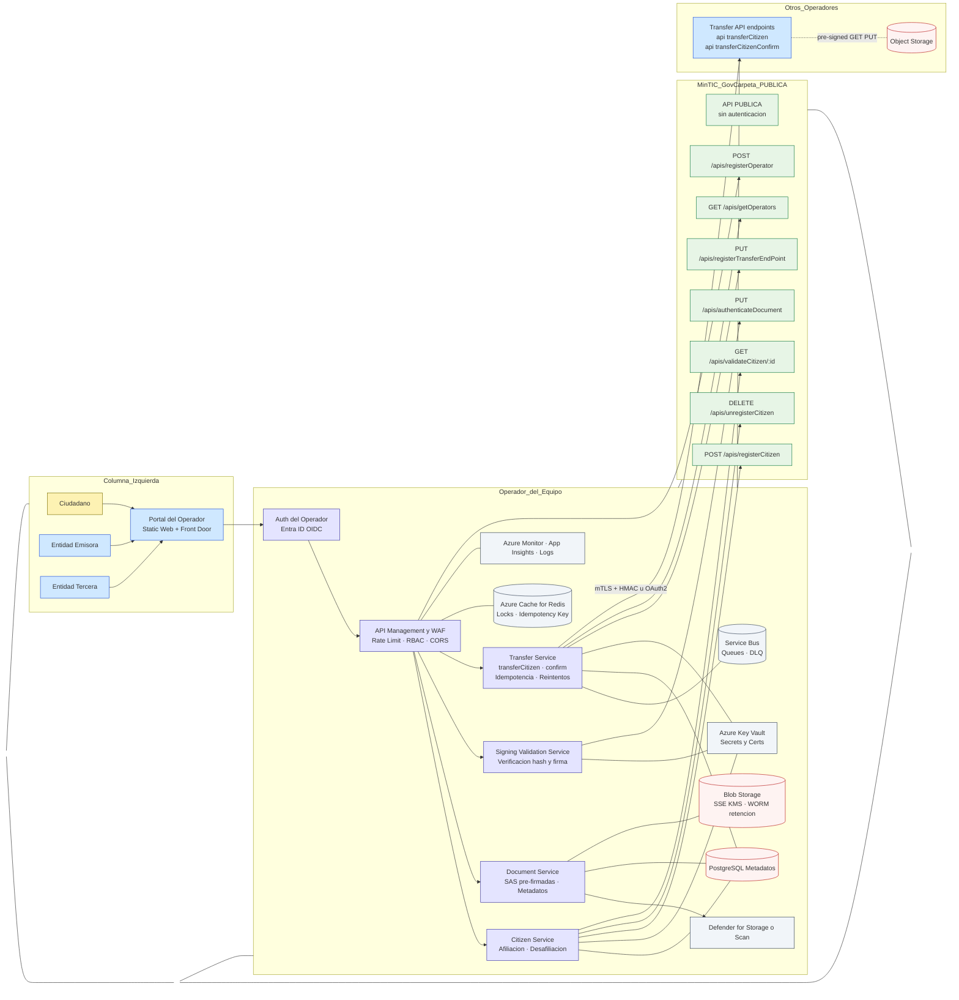

# Operador Carpeta Ciudadana — Implementación en Azure
> Documento único (.md) con arquitectura, flujos, tablas de CU, RNF y mapeo QoS, alineado a los endpoints **públicos** del hub **GovCarpeta** (MinTIC) y a los 5 casos de uso finales.

---

## 1) Alcance y Casos de Uso

**Casos de Uso del proyecto**
1. **Crear ciudadano**
2. **Autenticación de usuarios**
3. **Subir documentos** (URLs pre-firmadas)
4. **Autenticar o Firmar documentos**
5. **Transferencia de operador**  
   - Mecanismo operador a operador: **mTLS + HMAC** u **OAuth2 Client Credentials**  
   - Uso de **object storage** para **URLs pre-firmadas** (PUT/GET)

**Endpoints del hub GovCarpeta** *(públicos, sin autenticación)*  
- `POST /apis/registerCitizen`  
- `DELETE /apis/unregisterCitizen`  
- `PUT /apis/authenticateDocument`  
- `GET /apis/validateCitizen/{id}`  
- `POST /apis/registerOperator`  
- `PUT /apis/registerTransferEndPoint`  
- `GET /apis/getOperators`

> El hub **no transporta documentos**. Actúa como **directorio y registro**.

---

## 2) Arquitectura de referencia en Azure

### 2.1 Mapeo de componentes → servicios Azure

| Componente Lógico | Servicio Azure recomendado |
|---|---|
| Portal Ciudadano (SPA) | **Azure Static Web Apps** o **Front Door** + **Static Website** |
| API Gateway / WAF | **Azure API Management** + **Front Door WAF** o **Application Gateway WAF** |
| Microservicios (Citizen, Document, Signing, Transfer) | **Azure Kubernetes Service (AKS)** o **Azure App Service** |
| Identidad del Operador (IdP) | **Microsoft Entra ID** (OIDC), **APIM OAuth2** para CC, **mTLS** en Ingress |
| Object Storage (pre-firmadas) | **Azure Blob Storage** con **SAS** y **SSE con Key Vault** |
| DB Metadatos | **Azure Database for PostgreSQL** (o **Cosmos DB**) |
| Cache / Idempotencia | **Azure Cache for Redis** |
| Mensajería / DLQ | **Azure Service Bus** (colas y DLQ) |
| Anti-malware | **Microsoft Defender for Storage** (+ Azure Function opcional) |
| Observabilidad | **Azure Monitor**, **Application Insights**, **Log Analytics**, **OpenTelemetry** |
| Secretos y Certificados | **Azure Key Vault** (mTLS, HMAC, client secrets) |
| Inmutabilidad | **Blob Immutability Policy** (WORM) |
| Contenedores | **Azure Container Registry (ACR)** |
| CI/CD | **GitHub Actions** o **Azure DevOps** |

### 2.2 Diagrama de Contexto (Mermaid)



---

## 3) Flujo end-to-end por CU (resumen)

1. **CU2 Autenticación**: SPA → Entra ID (OIDC) → token a APIM → servicios.  
2. **CU1 Crear ciudadano**: Citizen Service crea local → **POST /apis/registerCitizen** al hub.  
3. **CU3 Subir documentos**: Document Service genera **SAS** (PUT/GET) → subida directa a Blob → scan → metadatos/auditoría.  
4. **CU4 Autenticar/Firmar**: verificación hash/firma → **PUT /apis/authenticateDocument** al hub.  
5. **CU5 Transferencia**: Transfer Service consulta hub (**getOperators, validateCitizen**) → **POST /api/transferCitizen** al destino con `urlDocuments` (SAS GET) + `confirmAPI` → destino descarga/verifica → **POST /api/transferCitizenConfirm** → origen **DELETE /apis/unregisterCitizen** y borrado soft→hard en Blob.

---

## 4) Tabla de Casos de Uso

| ID | Caso de Uso | Descripción breve | Endpoints del hub (GovCarpeta) | Endpoints O↔O (entre operadores) | Notas clave |
|---|---|---|---|---|---|
| CU1 | Crear ciudadano | Alta de ciudadano y notificación al hub | `POST /apis/registerCitizen` | — | Exclusividad de afiliación; hub sin auth |
| CU2 | Autenticación de usuarios | Inicio de sesión en portal del operador | — | — | Entra ID OIDC; sesiones seguras |
| CU3 | Subir documentos | SAS pre-firmadas PUT/GET; metadatos | — | — | Idempotencia; auditoría; scan |
| CU4 | Autenticar o Firmar documentos | Notificar autenticación de documento en hub | `PUT /apis/authenticateDocument` | — | Verificar hash/firma antes |
| CU5 | Transferencia de operador | Transferencia directa con confirmación | `GET /apis/getOperators`, `GET /apis/validateCitizen/{id}`, `PUT /apis/registerTransferEndPoint`, `DELETE /apis/unregisterCitizen` | `POST /api/transferCitizen`, `POST /api/transferCitizenConfirm` | mTLS + HMAC u OAuth2; SAS lectura; borrado post-confirmación |

---

## 5) Requisitos No Funcionales (RNF)

| Categoría | Requisito | Calidad del servicio o Restricción asociada |
|---|---|---|
| Disponibilidad | Acceso ininterrumpido a documentos críticos y a la API. | Documentos críticos ≥ **99.9%** mensual; API operador ≥ **99.5%** mensual. |
| Confidencialidad | Privacidad del contenido y controles de acceso. | Solo usuario asociado y entidades autorizadas; **0 exposiciones**. |
| Autenticación | Identidad en portal y canal O↔O. | Portal con políticas de contraseña; O↔O con **mTLS** y **HMAC** u **OAuth2 CC**; rotación ≤ **180 días**. |
| Autorización | Permisos granulares por carpeta/documento. | **0 accesos indebidos** en pruebas; RBAC/ABAC. |
| Rendimiento / Latencia | Tiempos adecuados en interacción y transferencia. | SAS p50 ≤ **200 ms**, p95 ≤ **500 ms**; metadatos transferencia p95 ≤ **2 s** (sin I/O binario). |
| Usabilidad | Accesibilidad y claridad de flujos. | **WCAG 2.1 AA**; éxito ≥ **95%** en tareas clave. |
| Escalabilidad | Soporte de picos manteniendo SLO. | Autoscaling < **60 s**; sostener RPS objetivo. |
| Almacenamiento | Capacidad y durabilidad de certificados. | Certificados sin límite; durabilidad ≈ **11×9**. |
| Observabilidad | Monitoreo, métricas, trazas, auditoría. | ≥ **90%** trazabilidad en CU3 y CU5; dashboards y alertas activos. |
| Resiliencia | Tolerancia a fallos y recuperación. | Circuit breakers, timeouts, backoff + jitter; DLQ; ≥ **95%** reintentos OK. |
| Privacidad y logs | Minimización de PII, retención. | **0 PII sensible** en logs; retención conforme a política. |
| Restricción: rol del hub | Hub como directorio/registro, sin payload. | **0 documentos** por hub; minimizar transacciones. |

---

## 6) Mapeo RNF vs QoS / ISO 25010

| Rnf (IDs) | Atributo de Calidad | SLI (Métrica) | SLO (Objetivo) | Verificación / Evidencia | CU impactados |
|---|---|---|---|---|---|
| Rnf 1.1–1.2 | Disponibilidad / Continuidad | Uptime API; Uptime documentos | API ≥ **99.5%**/mes; Docs ≥ **99.9%**/mes | Health checks, status page, reporte mensual | CU1–CU5 |
| Rnf 2.1–2.2 | Seguridad — Confidencialidad | Incidentes/mes; % ACL correctas | **0** incidentes; ≥ **99.99%** ACL | Auditoría de permisos; logs; pentest | CU2–CU5 |
| Rnf 3.1–3.2 | Seguridad — Autenticación | Éxito login; MFA; sesiones inválidas | ≥ **99%** éxito; ≥ **30%** MFA opcional; **0** falsos críticos | Pruebas de login; telemetría; hardening cookies | CU2 |
| Rnf 4.1–4.2 | Seguridad — Autorización | 401/403 mal config; cobertura reglas | **0** exposiciones; ≥ **95%** cobertura | Tests funcionales/seguridad; matriz RBAC | CU2–CU5 |
| Rnf 5.1–5.2 | Eficiencia del rendimiento | p50/p95 SAS; p95 metadatos O↔O | **200/500 ms**; **2 s** | Benchmarks; tracing; carga | CU3, CU5 |
| Rnf 6.1–6.2 | Usabilidad / Accesibilidad | Éxito de tareas; WCAG | ≥ **95%** éxito; **WCAG 2.1 AA** | Pruebas con usuarios; auditoría manual/axe | CU1–CU3 |
| Rnf 7.1–7.2 | Capacidad / Elasticidad | RPS sostenido; autoscaling | Mantener SLO; < **60 s** | Stress/soak; capacity planning | CU2, CU3, CU5 |
| Rnf 8.1–8.2 | Durabilidad / Capacidad | Durabilidad objetos; límites | Certificados sin límite; ≈ **11×9** | Lifecycle; verificación integridad | CU3–CU5 |
| Rnf 9.1–9.2 | Monitorización / Trazabilidad | Cobertura de trazas; dashboards | ≥ **90%** trazas; dashboards activos | Tracing CU3/CU5; alertas latencia/errores | CU3, CU5 |
| Rnf 10.1–10.2 | Confiabilidad — Fallos | % reintentos OK; timeouts | ≥ **95%** reintentos OK; **0** pérdidas | Circuit breakers; backoff+jitter; DLQ | CU3, CU5 |
| Rnf 11.1–11.2 | Cumplimiento / Privacidad | PII en logs; retención | **0** PII; retención OK | Escaneo de logs; políticas | CU2–CU5 |
| Rnf 12.1–12.2 | Eficiencia arquitectónica | Payload y transacciones en hub | **0** payload; registro/consulta | Revisión arquitectura; logs hub | CU1, CU4, CU5 |

---

## 7) Seguridad y contratos de transferencia

**Operador ↔ Operador**
- Opción A: **mTLS + HMAC**  
  Headers:  
  - `X-Operator-Id`, `X-Transfer-Id`, `Idempotency-Key`, `X-Timestamp`, `Authorization: HMAC-SHA256 <key-id>:<signature>`  
  - Firma = HMAC_SHA256(key, canonicalRequest) con método, path, query, headers y hash del body.
- Opción B: **OAuth2 Client Credentials** (issuer del operador destino), **scopes mínimos**.

**Endpoints del Operador**
- `POST /api/transferCitizen` (destino)  
  Body mínimo:
  ```json
  {
    "id": 1032236578,
    "citizenName": "Carlos Castro",
    "citizenEmail": "myemail@example.com",
    "urlDocuments": {
      "URL1": ["<sas-get-1>"]
    },
    "confirmAPI": "https://origen/api/transferCitizenConfirm"
  }
  ```
  Respuesta: `202 Accepted` (async) o `200 OK`.  
  **Verificar hash/firma** antes de confirmar.
- `POST /api/transferCitizenConfirm` (origen)  
  ```json
  { "id": 1032236578, "req_status": 1 }
  ```
  `1` éxito → **DELETE /apis/unregisterCitizen** y borrado soft→hard en Blob.

**Pre-firmadas (SAS)**  
- **PUT** para subir; **GET** para transferir/descargar.  
- TTL corto, permisos mínimos, opcional IP allowlist.  
- **WORM/retención** para certificados.

---

## 8) Observabilidad, SLO y alertas

- **App Insights + OpenTelemetry**: trazas en CU3 y CU5 (upload, transferencia, confirmación).  
- **Métricas**: latencia p50/p95 de SAS; p95 metadatos O↔O; tasa de errores; throughput.  
- **Alertas**: caída de SLO, errores 5xx en Transfer, DLQ > umbral, variación en hash/firma.  
- **Auditoría**: registros inmutables para altas, autenticaciones, transferencias, borrado.

---

## 9) CI/CD y IaC

**Pipeline sugerido (GitHub Actions):**
- Job `build`: build & push imágenes a **ACR**.  
- Job `deploy`: `helm upgrade --install` a **AKS** con **Workload Identity**.  
- APIM: importar OpenAPI y aplicar políticas (throttling, JWT/OAuth2 CC, validación headers HMAC).

**Esqueleto Bicep:**
```bicep
param location string = 'westus2'
param env string

resource rg 'Microsoft.Resources/resourceGroups@2021-04-01' = {
  name: 'rg-operator-${env}'
  location: location
}

module kv './modules/keyvault.bicep' = { name: 'kv' params: { rgName: rg.name env: env } }
module acr './modules/acr.bicep' = { name: 'acr' params: { rgName: rg.name env: env } }
module aks './modules/aks.bicep' = { name: 'aks' params: { rgName: rg.name kvId: kv.outputs.id env: env } }
module apim './modules/apim.bicep' = { name: 'apim' params: { rgName: rg.name env: env } }
module storage './modules/storage.bicep' = { name: 'blob' params: { rgName: rg.name env: env } }
module psql './modules/postgres.bicep' = { name: 'postgres' params: { rgName: rg.name env: env } }
module redis './modules/redis.bicep' = { name: 'redis' params: { rgName: rg.name env: env } }
module sb './modules/servicebus.bicep' = { name: 'servicebus' params: { rgName: rg.name env: env } }
module insights './modules/monitor.bicep' = { name: 'monitor' params: { rgName: rg.name env: env } }
```

---

## 10) Estructura de repo sugerida

```
/infra
  /bicep | /terraform
  README-infra.md
/services
  /citizen
  /document
  /signing
  /transfer
  /gateway   # definiciones OpenAPI, políticas APIM
/deploy
  helm charts, kustomize overlays
/web
  portal SPA
/docs
  RNF.md, Mapeo-RNF-QoS.md, diagramas.md
```

---

## 11) Checklist de “listo para producción” (curso)

- [ ] APIM/Front Door con WAF y rate-limiting.  
- [ ] **mTLS** interno y entre operadores.  
- [ ] **HMAC** u **OAuth2 CC** entre operadores; **rotación** de credenciales.  
- [ ] **SAS** con TTL corto y scope mínimo.  
- [ ] **Defender for Storage** activo; **WORM/retención** para certificados.  
- [ ] **Service Bus** con **DLQ** y reintentos con backoff+jitter.  
- [ ] **OpenTelemetry** + App Insights + alertas de SLO.  
- [ ] **Key Vault** con identidades administradas.  
- [ ] Borrado **soft→hard** tras confirmación de transferencia.  
- [ ] **DELETE /apis/unregisterCitizen** solo tras confirmación exitosa.
