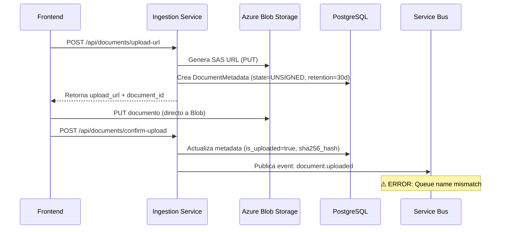
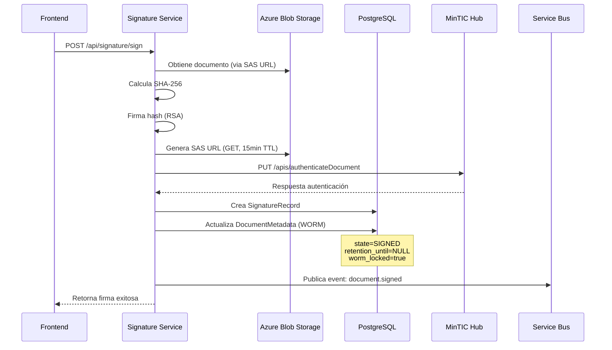

# Análisis de Ingestion y Signature Services

## 📋 Resumen Ejecutivo

Este documento analiza el funcionamiento de los servicios de **Ingestion** y **Signature**, su relación, flujos de trabajo, y estado actual.

---

## 🔗 Relación entre Ingestion y Signature

### **Sí, están relacionados** - Arquitectura Acoplada

Los servicios están **fuertemente relacionados** a través de:

1. **Base de Datos Compartida** (PostgreSQL)
   - Ambos acceden a la tabla `document_metadata`
   - Ingestion crea registros
   - Signature actualiza registros (WORM, estado, retención)

2. **Azure Blob Storage Compartido**
   - Ingestion genera URLs de subida
   - Signature lee documentos para firmar
   - Ambos usan el mismo contenedor

3. **Service Bus (Event-Driven)**
   - Ingestion publica eventos `document.uploaded`
   - Signature publica eventos `document.signed`, `document.authenticated`
   - Ingestion consume eventos `document.signed` para actualizar metadata

4. **Flujo de Trabajo Secuencial**
   - Ingestion → Crea documento (UNSIGNED)
   - Signature → Firma documento (SIGNED)
   - Signature → Actualiza metadata en BD (WORM, retención)

---

## 🔄 Flujo de Trabajo Completo

### **Fase 1: Ingestion - Subida de Documento**



**Estado del Documento después de Ingestion:**
- `state`: `UNSIGNED`
- `retention_until`: `created_at + 30 días`
- `worm_locked`: `false`
- `is_uploaded`: `true`
- `status`: `pending` o `uploaded`

---

### **Fase 2: Signature - Firma de Documento**



**Estado del Documento después de Signature:**
- `state`: `SIGNED` ✅
- `retention_until`: `NULL` (ETERNAL) ✅
- `worm_locked`: `true` ✅
- `signed_at`: Timestamp de firma
- `hub_signature_ref`: Referencia del Hub MinTIC

---

## 📊 Estado Actual de los Servicios

### **Ingestion Service**

#### ✅ **Funcionando Correctamente:**
- ✅ Health checks: OK
- ✅ Readiness: OK (database connected)
- ✅ Generación de SAS URLs: OK
- ✅ Almacenamiento de metadata: OK
- ✅ Listado de documentos: OK

#### ⚠️ **Problemas Identificados:**

1. **Service Bus - Error de Configuración**
   ```
   ERROR: Failed to publish document.uploaded event: 
   The queue name provided does not match the EntityPath 
   in the connection string used to construct the ServiceBusClient.
   ```
   - **Impacto**: Los eventos `document.uploaded` no se publican
   - **Causa**: Configuración incorrecta del Service Bus (queue name vs EntityPath)
   - **Ubicación**: `services/ingestion/app/service_bus.py:112`

2. **Logs Recientes:**
   - ✅ Documentos creados correctamente
   - ✅ Metadata almacenada correctamente
   - ❌ Eventos no publicados (Service Bus error)

---

### **Signature Service**

#### ✅ **Funcionando Correctamente:**
- ✅ Health checks: OK
- ✅ Readiness: OK
- ✅ Firma de documentos: OK
- ✅ Actualización de metadata (WORM): OK
- ✅ Integración con MinTIC Hub: OK

#### ⚠️ **Observaciones:**

1. **Fetch de Documento Simplificado**
   ```python
   # Línea 61 en signature.py
   document_data = f"DOCUMENT_CONTENT_{request.document_id}".encode()
   ```
   - **Problema**: No obtiene el documento real de Blob Storage
   - **Impacto**: El SHA-256 calculado no es del documento real
   - **Solución necesaria**: Obtener documento real de Blob Storage

2. **Actualización de Metadata**
   - ✅ Funciona correctamente
   - ✅ Actualiza `state` a `SIGNED`
   - ✅ Activa WORM (`worm_locked = true`)
   - ✅ Establece retención eterna (`retention_until = NULL`)

---

## 🔄 Flujo de Datos Detallado

### **1. Creación de Documento (Ingestion)**

**Endpoint:** `POST /api/documents/upload-url`

**Proceso:**
1. Valida `citizen_id` (debe ser numérico)
2. Genera `document_id` (UUID)
3. Genera SAS URL para PUT en Blob Storage
4. Crea registro en `document_metadata`:
   ```python
   DocumentMetadata(
       id=document_id,
       citizen_id=citizen_id,
       filename=filename,
       state="UNSIGNED",
       retention_until=date.today() + timedelta(days=30),
       status="pending"
   )
   ```
5. Intenta publicar evento `document.uploaded` (falla por Service Bus)

**Resultado:**
- Documento creado en BD
- Metadata almacenada
- SAS URL generada
- Evento NO publicado (error Service Bus)

---

### **2. Confirmación de Subida (Ingestion)**

**Endpoint:** `POST /api/documents/confirm-upload`

**Proceso:**
1. Valida existencia del documento en Blob Storage
2. Calcula SHA-256 del documento
3. Actualiza metadata:
   - `is_uploaded = true`
   - `sha256_hash = hash_calculado`
   - `size_bytes = tamaño`
4. Intenta publicar evento `document.uploaded` (falla por Service Bus)

---

### **3. Firma de Documento (Signature)**

**Endpoint:** `POST /api/signature/sign`

**Proceso:**
1. **Obtiene documento** (actualmente simplificado - NO obtiene documento real)
2. Calcula SHA-256 (del documento simulado)
3. Firma hash con RSA
4. Genera SAS URL para Hub MinTIC (GET, 15min TTL)
5. Autentica con MinTIC Hub:
   ```json
   {
     "idCitizen": citizen_id,
     "UrlDocument": sas_url,
     "documentTitle": document_title
   }
   ```
6. Guarda `SignatureRecord` en BD
7. **Actualiza `DocumentMetadata`** (CRÍTICO):
   ```sql
   UPDATE document_metadata
   SET 
       state = 'SIGNED',
       retention_until = NULL,  -- ETERNAL
       worm_locked = true,
       signed_at = NOW(),
       hub_signature_ref = 'hub-sig-xxx'
   WHERE id = document_id
   ```
8. Publica eventos:
   - `document.signed`
   - `document.authenticated`
   - `document.hubAuthenticated`

**Resultado:**
- Documento firmado
- Metadata actualizada (WORM activado)
- Retención eterna establecida
- Eventos publicados

---

## 🗄️ Base de Datos Compartida

### **Tabla: `document_metadata`**

**Campos Relevantes:**

| Campo | Ingestion | Signature | Descripción |
|-------|-----------|-----------|-------------|
| `id` | ✅ Crea | ✅ Usa | UUID del documento |
| `citizen_id` | ✅ Crea | ✅ Usa | ID del ciudadano |
| `state` | ✅ `UNSIGNED` | ✅ `SIGNED` | Estado del documento |
| `retention_until` | ✅ `+30 días` | ✅ `NULL` (ETERNAL) | Fecha de retención |
| `worm_locked` | ✅ `false` | ✅ `true` | Bloqueo WORM |
| `signed_at` | ❌ | ✅ `NOW()` | Timestamp de firma |
| `hub_signature_ref` | ❌ | ✅ Referencia | Ref del Hub MinTIC |
| `sha256_hash` | ✅ Calcula | ✅ Usa | Hash del documento |

**Trigger de Base de Datos:**
- `prevent_worm_update()`: Previene modificación de documentos firmados
- `set_retention_on_sign()`: Establece retención automáticamente

---

## 📡 Service Bus - Eventos

### **Eventos Publicados por Ingestion:**

| Evento | Cuándo | Estado |
|--------|--------|--------|
| `document.uploaded` | Después de confirmar upload | ❌ **FALLA** (Service Bus error) |
| `document.deleted` | Al eliminar documento | ⚠️ No verificado |

### **Eventos Publicados por Signature:**

| Evento | Cuándo | Estado |
|--------|--------|--------|
| `document.signed` | Después de firmar | ✅ Publicado |
| `document.authenticated` | Después de autenticar con Hub | ✅ Publicado |
| `document.hubAuthenticated` | Después de autenticar con Hub | ✅ Publicado |
| `document.verified` | Al verificar firma | ✅ Publicado |

### **Eventos Consumidos por Ingestion:**

| Evento | Acción | Estado |
|--------|--------|--------|
| `document.signed` | Actualiza metadata | ✅ Consumido |
| `document.authenticated` | Actualiza `hub_signature_ref` | ✅ Consumido |

---

## ⚠️ Problemas Identificados

### **1. Service Bus - Error de Configuración (Ingestion)**

**Error:**
```
Failed to publish document.uploaded event: 
The queue name provided does not match the EntityPath 
in the connection string used to construct the ServiceBusClient.
```

**Causa:**
- El `connection_string` de Service Bus incluye el `EntityPath` (nombre de la cola)
- El código intenta especificar el `queue_name` nuevamente
- Azure Service Bus no permite ambos

**Solución:**
- Opción 1: Remover `EntityPath` del `connection_string`
- Opción 2: No especificar `queue_name` en el código (usar el del connection string)

**Ubicación:** `services/ingestion/app/service_bus.py:112`

---

### **2. Fetch de Documento Simplificado (Signature)**

**Problema:**
```python
# Línea 61 en signature.py
document_data = f"DOCUMENT_CONTENT_{request.document_id}".encode()
```

**Impacto:**
- El SHA-256 calculado NO es del documento real
- La firma NO corresponde al documento real
- La verificación fallará

**Solución Necesaria:**
```python
# Obtener documento real de Blob Storage
blob_client = blob_service_client.get_blob_client(
    container=container_name,
    blob=blob_name
)
document_data = await blob_client.download_blob().readall()
```

---

## ✅ Funcionalidades que SÍ Funcionan

### **Ingestion:**
- ✅ Generación de SAS URLs
- ✅ Almacenamiento de metadata
- ✅ Listado de documentos
- ✅ Confirmación de upload
- ✅ Cálculo de SHA-256
- ✅ Gestión de retención (30 días para UNSIGNED)

### **Signature:**
- ✅ Firma de documentos (aunque con documento simulado)
- ✅ Actualización de metadata (WORM)
- ✅ Establecimiento de retención eterna
- ✅ Integración con MinTIC Hub
- ✅ Publicación de eventos
- ✅ Verificación de firmas

---

## 🔄 Flujo de Integración Actual

```
1. Frontend → Ingestion: POST /api/documents/upload-url
   ↓
2. Ingestion → Blob Storage: Genera SAS URL
   ↓
3. Ingestion → PostgreSQL: Crea DocumentMetadata (UNSIGNED, retention=30d)
   ↓
4. Frontend → Blob Storage: PUT documento (directo)
   ↓
5. Frontend → Ingestion: POST /api/documents/confirm-upload
   ↓
6. Ingestion → PostgreSQL: Actualiza metadata (is_uploaded=true, sha256_hash)
   ↓
7. Ingestion → Service Bus: Intenta publicar document.uploaded ❌ (FALLA)
   ↓
8. Frontend → Signature: POST /api/signature/sign
   ↓
9. Signature → Blob Storage: Obtiene documento (SIMPLIFICADO - NO REAL)
   ↓
10. Signature → Signature: Calcula SHA-256 (del documento simulado)
   ↓
11. Signature → Signature: Firma hash (RSA)
   ↓
12. Signature → MinTIC Hub: PUT /apis/authenticateDocument
   ↓
13. Signature → PostgreSQL: Crea SignatureRecord
   ↓
14. Signature → PostgreSQL: Actualiza DocumentMetadata (SIGNED, WORM, ETERNAL)
   ↓
15. Signature → Service Bus: Publica document.signed ✅
   ↓
16. Ingestion → Service Bus: Consume document.signed ✅
   ↓
17. Ingestion → PostgreSQL: Actualiza metadata (hub_signature_ref)
```

---

## 📈 Métricas y Estado

### **Ingestion Service:**
- **Uptime**: 106 minutos
- **Health**: ✅ Healthy
- **Readiness**: ✅ Ready (database connected)
- **Última actividad**: Generación de upload URLs
- **Errores**: Service Bus configuration error

### **Signature Service:**
- **Uptime**: 152 minutos
- **Health**: ✅ Healthy
- **Readiness**: ✅ Ready
- **Última actividad**: Health checks
- **Errores**: Ninguno visible en logs recientes

---

## 🎯 Recomendaciones

### **Crítico:**
1. **Corregir fetch de documento en Signature**
   - Obtener documento real de Blob Storage
   - Calcular SHA-256 del documento real
   - Firmar el hash correcto

2. **Corregir Service Bus en Ingestion**
   - Ajustar configuración de connection string
   - Permitir publicación de eventos `document.uploaded`

### **Importante:**
3. **Mejorar logging**
   - Agregar más contexto en logs de firma
   - Loggear cuando se actualiza metadata

4. **Validación de integridad**
   - Verificar que el documento existe antes de firmar
   - Validar que el SHA-256 coincide

---

## 📚 Referencias

- [Ingestion Service README](../../services/ingestion/README.md)
- [Signature Service README](../../services/signature/README.md)
- [Análisis de Arquitectura](./ANALISIS_ARQUITECTURA.md)
- [Verificación Funcional](./VERIFICACION_FUNCIONAL.md)

---

**Última actualización:** 2025-11-06  
**Estado:** Análisis completo - Problemas identificados

