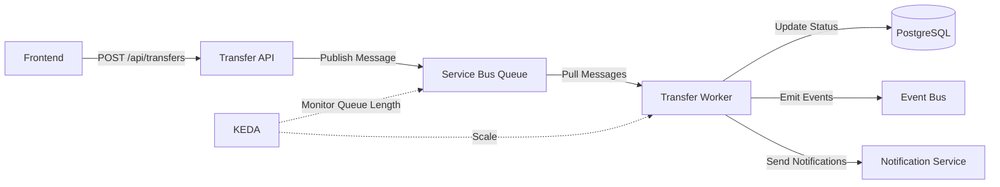

# 🚀 KEDA + Transfer Worker Architecture

**Fecha**: 2025-10-13  
**Versión**: 1.0  
**Autor**: Manuel Jurado

Documentación de la arquitectura de auto-scaling con KEDA y Transfer Worker.

---

## 📋 Índice

1. [Descripción General](#descripción-general)
2. [Componentes](#componentes)
3. [Flujo de Procesamiento](#flujo-de-procesamiento)
4. [Auto-Scaling con KEDA](#auto-scaling-con-keda)
5. [Spot Instances](#spot-instances)
6. [Configuración](#configuración)
7. [Monitoring](#monitoring)
8. [Troubleshooting](#troubleshooting)

---

## 🎯 Descripción General

El **Transfer Worker** es un servicio dedicado que consume mensajes de transferencia desde Azure Service Bus y los procesa de forma asíncrona. Utiliza **KEDA** (Kubernetes Event-Driven Autoscaling) para escalar automáticamente basándose en la longitud de la cola.

### Beneficios

✅ **Desacoplamiento**: API y procesamiento son independientes  
✅ **Escalabilidad**: Escala de 0 a 30 réplicas automáticamente  
✅ **Costo-Eficiencia**: Usa spot instances (70% más baratas)  
✅ **Resiliencia**: DLQ para mensajes fallidos  
✅ **Observabilidad**: Métricas de Prometheus integradas  

---

## 🔧 Componentes

### 1. Transfer API (Existing)

Servicio REST que acepta solicitudes de transferencia y las publica a Service Bus.

```
POST /api/transfers
→ Valida request
→ Publica mensaje a Service Bus queue "transfers"
→ Retorna 202 Accepted
```

### 2. Azure Service Bus Queue

Cola de mensajes que almacena transferencias pendientes.

- **Queue Name**: `transfers`
- **Max Delivery Count**: 3
- **Lock Duration**: 5 minutos
- **Dead Letter Queue**: Sí

### 3. KEDA (Event-Driven Autoscaler)

Componente que monitorea la cola y escala los workers.

- **Trigger**: `azure-servicebus`
- **Metric**: Queue length
- **Target**: 5 mensajes por pod

### 4. Transfer Worker

Servicio consumer que procesa mensajes.

- **Port**: 8012
- **Endpoints**: `/health`, `/ready`, `/metrics`
- **Max Concurrent**: 10 mensajes por pod

---

## 📊 Flujo de Procesamiento



### Paso a Paso

1. **Request HTTP**: Usuario solicita transferencia vía API
2. **Validación**: API valida permisos y datos
3. **Publicación**: API publica mensaje a Service Bus queue
4. **Auto-Scaling**: KEDA detecta mensaje y escala worker (si está en 0)
5. **Consumo**: Worker recibe mensaje de la cola
6. **Procesamiento**: Worker ejecuta lógica de transferencia
   - Valida ownership
   - Copia referencias de documentos
   - Actualiza estado en DB
   - Emite eventos
   - Envía notificaciones
7. **Completion**: Worker completa mensaje (lo elimina de la cola)
8. **Scale Down**: Si cola vacía por 5 minutos, KEDA escala a 0

---

## ⚙️ Auto-Scaling con KEDA

### Configuración de Scaling

```yaml
spec:
  minReplicaCount: 0        # Escala a zero cuando cola vacía
  maxReplicaCount: 30       # Máximo 30 pods bajo carga extrema
  pollingInterval: 30       # Chequea cola cada 30 segundos
  cooldownPeriod: 300       # Espera 5 minutos antes de scale-down
  
  triggers:
  - type: azure-servicebus
    metadata:
      queueName: transfers
      messageCount: "5"      # Target: 5 mensajes por pod
      activationMessageCount: "1"  # Activa desde 0 con 1 mensaje
```

### Comportamiento de Scaling

| Queue Length | Replicas | Rationale |
|--------------|----------|-----------|
| 0 | 0 | Sin trabajo, escala a cero (ahorro de costos) |
| 1-5 | 1 | Un pod maneja hasta 5 mensajes |
| 6-10 | 2 | Dos pods (5 mensajes c/u) |
| 11-15 | 3 | Tres pods |
| 100 | 20 | 20 pods (5 mensajes c/u) |
| 150+ | 30 | Máximo de 30 pods |

### Políticas Avanzadas

**Scale Up** (rápido):
- 100% increase cada 15 segundos
- O +4 pods cada 15 segundos
- Lo que sea mayor

**Scale Down** (conservador):
- 50% decrease cada 60 segundos
- O -2 pods cada 60 segundos
- Stabilization window: 5 minutos

---

## 💰 Spot Instances

Los workers corren en **spot instances** para reducir costos.

### Configuración

```yaml
nodeSelector:
  workload: "workers"
  kubernetes.azure.com/scalesetpriority: "spot"

tolerations:
- key: "kubernetes.azure.com/scalesetpriority"
  operator: "Equal"
  value: "spot"
  effect: "NoSchedule"
```

### Ventajas

✅ **70-90% más baratas** que instancias regulares  
✅ **Apropiadas para workloads stateless**  
✅ **KEDA re-escala automáticamente** si nodo preempted  

### Consideraciones

⚠️ **Preemption**: Azure puede recuperar el nodo con 30 segundos de aviso  
⚠️ **Graceful Shutdown**: Worker tiene 60 segundos para completar mensajes  
⚠️ **Idempotencia**: Procesamiento debe ser idempotente por re-delivery  

---

## 🔧 Configuración

### Helm Values

```yaml
transferWorker:
  enabled: true
  replicaCount: 0  # KEDA controla
  
  queueName: "transfers"
  maxConcurrent: 10
  
  keda:
    enabled: true
    minReplicas: 0
    maxReplicas: 30
    targetQueueLength: 5
  
  nodeSelector:
    kubernetes.azure.com/scalesetpriority: "spot"
```

### Variables de Entorno

| Variable | Descripción | Default |
|----------|-------------|---------|
| `SERVICEBUS_CONNECTION_STRING` | Connection string de Service Bus | Required |
| `SERVICEBUS_TRANSFER_QUEUE` | Nombre de la cola | `transfers` |
| `MAX_CONCURRENT_MESSAGES` | Máx mensajes concurrentes | `10` |
| `PREFETCH_COUNT` | Mensajes pre-cargados | `20` |
| `MAX_WAIT_TIME` | Timeout espera mensajes (seg) | `60` |

### Terraform

KEDA se instala vía módulo Terraform:

```hcl
module "keda" {
  source = "./modules/keda"
  
  keda_version  = "2.13.0"
  replica_count = 2  # HA para KEDA operator
  
  enable_servicebus_trigger = true
  enable_prometheus_monitoring = true
}
```

---

## 📊 Monitoring

### Métricas Clave

#### KEDA Operator
- `keda_scaler_active` - ¿Scaler activo?
- `keda_scaler_errors_total` - Errores de scaling
- `keda_scaled_object_paused` - ¿ScaledObject pausado?

#### Transfer Worker
- `transfer_worker_messages_processed_total`
- `transfer_worker_messages_failed_total`
- `transfer_worker_processing_duration_seconds`
- `transfer_worker_queue_length_gauge`

#### Service Bus
- `servicebus_queue_active_messages` - Mensajes en cola
- `servicebus_queue_dead_letter_messages` - Mensajes en DLQ
- `servicebus_queue_size_bytes` - Tamaño de cola

### Dashboards

**Grafana Dashboard**: `observability/grafana-dashboards/transfer-worker.json`

Panels:
- Queue length over time
- Replica count over time
- Processing rate (msg/sec)
- Error rate
- P95 latency
- DLQ count

### Alertas

```yaml
- alert: TransferWorkerHighErrorRate
  expr: rate(transfer_worker_messages_failed_total[5m]) > 0.1
  for: 5m
  annotations:
    summary: "Transfer worker error rate > 10%"

- alert: TransferWorkerDLQAccumulation
  expr: servicebus_queue_dead_letter_messages{queue="transfers"} > 100
  for: 10m
  annotations:
    summary: "More than 100 messages in DLQ"

- alert: TransferWorkerHighLatency
  expr: histogram_quantile(0.95, transfer_worker_processing_duration_seconds) > 30
  for: 5m
  annotations:
    summary: "P95 processing time > 30 seconds"
```

---

## 🔍 Troubleshooting

### Worker no escala

**Síntoma**: Hay mensajes en la cola pero workers permanecen en 0.

**Checklist**:
1. ✅ KEDA operator corriendo: `kubectl get pods -n keda-system`
2. ✅ ScaledObject existe: `kubectl get scaledobject`
3. ✅ TriggerAuthentication correcto: `kubectl get triggerauthentication`
4. ✅ Service Bus connection string válido
5. ✅ Queue name correcto en ScaledObject

**Debug**:
```bash
# Ver logs de KEDA operator
kubectl logs -n keda-system deployment/keda-operator

# Describe ScaledObject
kubectl describe scaledobject transfer-worker

# Ver HPA generado por KEDA
kubectl get hpa
```

### Worker crashea constantemente

**Síntoma**: Pods en CrashLoopBackOff.

**Checklist**:
1. ✅ Service Bus connection string válido
2. ✅ Suficientes recursos (memory, CPU)
3. ✅ Database accesible
4. ✅ No memory leaks

**Debug**:
```bash
# Ver logs del pod
kubectl logs -l app=transfer-worker --tail=100

# Ver eventos
kubectl get events --sort-by='.lastTimestamp'

# Ver recursos
kubectl top pods -l app=transfer-worker
```

### Mensajes van a DLQ

**Síntoma**: Dead Letter Queue acumulando mensajes.

**Causas comunes**:
- Error en lógica de procesamiento
- Timeout (>5 minutos por mensaje)
- Mensaje malformado

**Solución**:
```bash
# Ver mensajes en DLQ
az servicebus queue show \
  --name transfers \
  --namespace-name carpeta-sb \
  --resource-group carpeta-rg \
  --query deadLetterMessageCount

# Procesar manualmente (Azure Portal)
# Service Bus → Queue → Dead-letter messages → Peek
```

### Spot instance preempted

**Síntoma**: Worker termina abruptamente con exit code 143.

**Comportamiento esperado**:
- KEDA automáticamente escala nuevo pod
- Mensaje retorna a cola (lock expires)
- Nuevo pod procesa mensaje

**Prevención**:
- Implementar idempotencia en procesamiento
- Graceful shutdown de 60 segundos
- Message lock duration adecuado

---

## 📚 Referencias

- [KEDA Documentation](https://keda.sh/)
- [Azure Service Bus Scaler](https://keda.sh/docs/latest/scalers/azure-service-bus/)
- [Azure Spot VMs](https://learn.microsoft.com/en-us/azure/virtual-machines/spot-vms)
- [Kubernetes HPA](https://kubernetes.io/docs/tasks/run-application/horizontal-pod-autoscale/)

---

## ✅ Checklist de Implementación

- [x] Módulo KEDA Terraform creado
- [x] Transfer Worker service implementado
- [x] Dockerfile para worker
- [x] ScaledObject KEDA configurado
- [x] Helm template deployment
- [x] Values.yaml actualizado
- [x] CI/CD actualizado
- [ ] Spot node pool en AKS (pendiente)
- [ ] Métricas Prometheus implementadas
- [ ] Dashboard Grafana creado
- [ ] Alertas configuradas
- [ ] Load testing ejecutado

---

**Generado**: 2025-10-13 01:00  
**Autor**: Manuel Jurado  
**Versión**: 1.0

