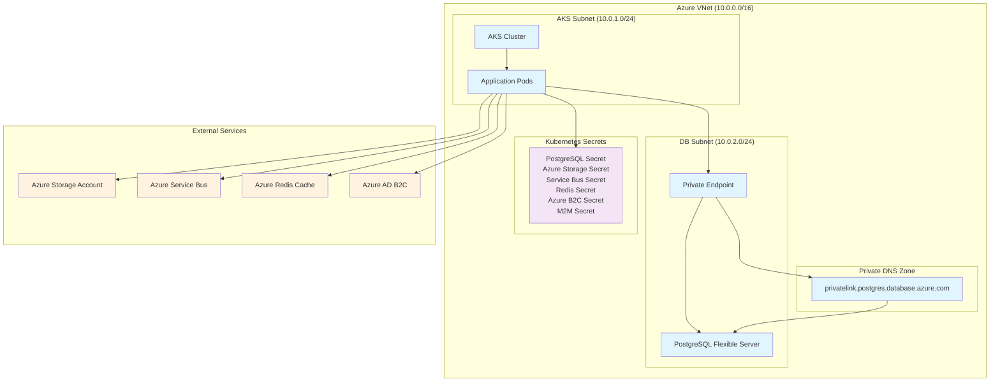

# Arquitectura de Private Endpoint

## Diagrama de la Arquitectura

## Flujo de Conexión

1. **Pods de Aplicación** acceden a los **Kubernetes Secrets** para obtener credenciales
2. **DNS Privado** resuelve el FQDN del PostgreSQL a una IP privada
3. **Private Endpoint** proporciona la conexión privada al PostgreSQL
4. **PostgreSQL** está completamente aislado de Internet pública
5. **Servicios externos** (Storage, Service Bus, Redis, B2C) se conectan a través de sus respectivos endpoints

## Beneficios de Seguridad

- ✅ **Tráfico Privado**: Todo el tráfico entre AKS y PostgreSQL ocurre dentro de la VNet
- ✅ **Sin Exposición Pública**: PostgreSQL no tiene IP pública
- ✅ **DNS Privado**: Resolución DNS interna sin exposición a Internet
- ✅ **Secrets Seguros**: Credenciales almacenadas en Kubernetes Secrets
- ✅ **Cumplimiento**: Cumple con estándares de seguridad empresarial

## Componentes Clave

### Private Endpoint
- **Función**: Proporciona IP privada para acceder al PostgreSQL
- **Ubicación**: En la subnet de AKS
- **Conexión**: Automática con el servidor PostgreSQL

### Private DNS Zone
- **Zona DNS**: `privatelink.postgres.database.azure.com`
- **Función**: Resuelve el FQDN del PostgreSQL a una IP privada
- **Vinculación**: Conectada a la VNet principal

### Kubernetes Secrets
- **PostgreSQL Secret**: Credenciales y FQDN privado
- **Azure Storage Secret**: Credenciales de Azure Storage
- **Service Bus Secret**: Connection string de Service Bus
- **Redis Secret**: Credenciales de Redis
- **Azure AD B2C Secret**: Configuración de autenticación
- **M2M Secret**: Clave para autenticación machine-to-machine
