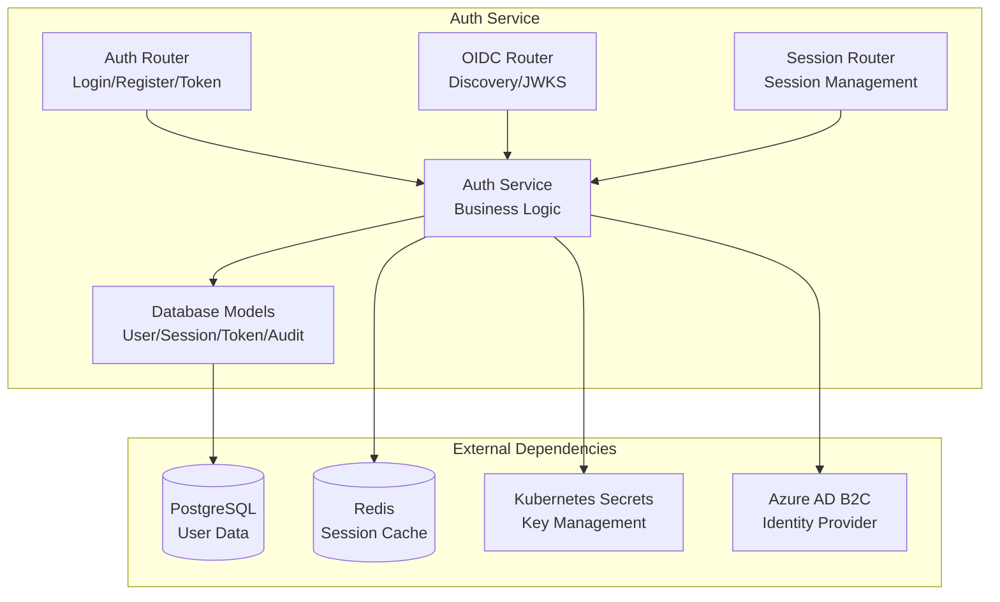
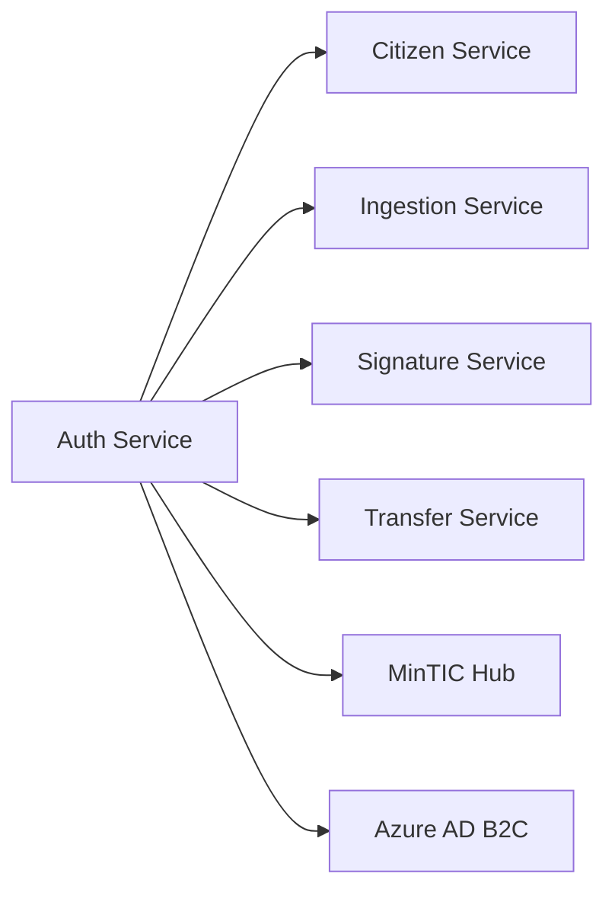

# 🔐 Auth Service - Servicio de Autenticación y Autorización

> **Servicio de autenticación y autorización con soporte OIDC para el Operador Carpeta Ciudadana**

---

## 📋 Resumen Ejecutivo

El **Auth Service** es un microservicio especializado en autenticación y autorización que forma parte del ecosistema del **Operador Carpeta Ciudadana**. Implementa estándares **OIDC (OpenID Connect)** y **OAuth2** para proporcionar autenticación segura, gestión de sesiones y autorización granular para ciudadanos y operadores.

### 🎯 Características Principales

- ✅ **Autenticación OIDC completa** con endpoints de descubrimiento
- ✅ **OAuth2** con soporte para múltiples grant types
- ✅ **Gestión de sesiones** con Redis y PostgreSQL
- ✅ **Autorización granular** con roles y permisos
- ✅ **Auditoría completa** de eventos de autenticación
- ✅ **Integración con Azure AD B2C** (preparado)
- ✅ **Seguridad robusta** con JWT, HMAC y mTLS

---

## 🏗️ Arquitectura del Servicio

### Componentes Principales



### Estructura del Código

```
services/auth/
├── app/
│   ├── config.py          # Configuración con Pydantic Settings
│   ├── database.py        # Conexión y gestión de BD
│   ├── models.py          # Modelos SQLAlchemy
│   ├── main.py           # Aplicación FastAPI
│   ├── services/
│   │   └── auth_service.py # Lógica de negocio
│   └── routers/
│       ├── auth.py       # Endpoints de autenticación
│       ├── oidc.py       # Endpoints OIDC
│       └── sessions.py   # Gestión de sesiones
├── tests/                # Tests unitarios y de integración
├── pyproject.toml        # Dependencias y configuración
└── README.md            # Este documento
```

---

## 🚀 Casos de Uso Principales

### CU1: Autenticación de Usuarios (CU2 del documento de referencia)

**Descripción**: Los ciudadanos y operadores pueden autenticarse de forma segura en el portal del operador.

**Flujo**:
1. Usuario accede al portal
2. Redirige a Azure AD B2C (OIDC)
3. Usuario se autentica con credenciales
4. B2C retorna código de autorización
5. Auth Service intercambia código por tokens
6. Se crea sesión segura con JWT

**Endpoints**:
- `POST /api/auth/login` - Autenticación tradicional
- `POST /api/auth/register` - Registro de usuarios
- `POST /api/auth/token` - Intercambio de tokens OAuth2
- `GET /api/auth/userinfo` - Información del usuario autenticado

**Ejemplo de Request**:
```json
POST /api/auth/login
{
  "email": "ciudadano@example.com",
  "password": "password123"
}
```

**Ejemplo de Response**:
```json
{
  "id": "user-123",
  "email": "ciudadano@example.com",
  "name": "Juan Pérez",
  "given_name": "Juan",
  "family_name": "Pérez",
  "roles": ["citizen"],
  "permissions": ["read:own_documents", "upload:documents"]
}
```

### CU2: Gestión de Sesiones

**Descripción**: Gestión segura de sesiones de usuario con soporte para múltiples dispositivos.

**Flujo**:
1. Usuario autenticado solicita sesión
2. Se crea sesión con TTL configurable
3. Sesión se almacena en Redis para rendimiento
4. Se registra en PostgreSQL para auditoría
5. Soporte para refresh y logout

**Endpoints**:
- `POST /api/sessions/` - Crear nueva sesión
- `GET /api/sessions/{session_id}` - Obtener sesión
- `DELETE /api/sessions/{session_id}` - Cerrar sesión
- `POST /api/sessions/{session_id}/refresh` - Refrescar sesión

**Ejemplo de Request**:
```json
POST /api/sessions/
{
  "user_id": "user-123",
  "email": "ciudadano@example.com",
  "name": "Juan Pérez",
  "roles": ["citizen"],
  "permissions": ["read:own_documents"]
}
```

### CU3: Autorización Granular

**Descripción**: Sistema de autorización basado en roles (RBAC) y atributos (ABAC).

**Características**:
- **Roles**: `citizen`, `operator`, `admin`
- **Permisos**: `read:own_documents`, `upload:documents`, `sign:documents`
- **Contexto**: Validación basada en recursos y contexto

**Ejemplo de Configuración**:
```json
{
  "roles": {
    "citizen": ["read:own_documents", "upload:documents"],
    "operator": ["read:all_documents", "sign:documents", "transfer:citizens"],
    "admin": ["*"]
  }
}
```

### CU4: Integración OIDC

**Descripción**: Implementación completa del protocolo OpenID Connect para integración con clientes OIDC.

**Endpoints OIDC**:
- `GET /.well-known/openid-configuration` - Discovery endpoint
- `GET /.well-known/jwks.json` - Claves públicas para verificación
- `POST /api/auth/authorize` - Endpoint de autorización
- `POST /api/auth/token` - Endpoint de tokens
- `GET /api/auth/userinfo` - Información del usuario

**Ejemplo de Discovery**:
```json
GET /.well-known/openid-configuration
{
  "issuer": "https://auth.operador.com",
  "authorization_endpoint": "https://auth.operador.com/api/auth/authorize",
  "token_endpoint": "https://auth.operador.com/api/auth/token",
  "userinfo_endpoint": "https://auth.operador.com/api/auth/userinfo",
  "jwks_uri": "https://auth.operador.com/.well-known/jwks.json",
  "scopes_supported": ["openid", "profile", "email"],
  "response_types_supported": ["code", "token", "id_token"],
  "grant_types_supported": ["authorization_code", "refresh_token", "client_credentials"]
}
```

---

## 🔧 Configuración y Despliegue

### Variables de Entorno

```bash
# Database Configuration
DB_HOST=mock-postgres-host.database.azure.com
DB_PORT=5432
DB_NAME=carpeta_ciudadana
DB_USER=psqladmin
DB_PASSWORD=mock_password_123
DB_SSLMODE=require

# Redis Configuration
REDIS_HOST=localhost
REDIS_PORT=6379
REDIS_PASSWORD=
REDIS_DB=1

# JWT Configuration
JWT_ALGORITHM=RS256
JWT_ACCESS_TOKEN_EXPIRE_MINUTES=60
JWT_REFRESH_TOKEN_EXPIRE_DAYS=30
JWT_PRIVATE_KEY_PATH=/etc/auth/private_key.pem
JWT_PUBLIC_KEY_PATH=/etc/auth/public_key.pem

# OIDC Configuration
OIDC_ISSUER_URL=https://auth.operador.com

# Azure AD B2C Configuration
AZURE_AD_B2C_TENANT_NAME=carpetaciudadana
AZURE_AD_B2C_TENANT_ID=tenant-id
AZURE_AD_B2C_CLIENT_ID=client-id

# Application Configuration
ENVIRONMENT=production
DEBUG=false
LOG_LEVEL=INFO
CORS_ALLOWED_ORIGINS=https://portal.operador.com,https://api.operador.com
```

### Despliegue con Docker

```dockerfile
FROM python:3.13-slim

WORKDIR /app

# Install dependencies
COPY pyproject.toml poetry.lock ./
RUN pip install poetry && poetry install --no-dev

# Copy application
COPY . .

# Run application
CMD ["uvicorn", "app.main:app", "--host", "0.0.0.0", "--port", "8011"]
```

### Despliegue con Helm

```yaml
# values.yaml
replicaCount: 3

image:
  repository: auth-service
  tag: "1.0.0"
  pullPolicy: IfNotPresent

service:
  type: ClusterIP
  port: 8011

ingress:
  enabled: true
  className: nginx
  annotations:
    cert-manager.io/cluster-issuer: letsencrypt-prod
  hosts:
    - host: auth.operador.com
      paths:
        - path: /
          pathType: Prefix
  tls:
    - secretName: auth-tls
      hosts:
        - auth.operador.com

resources:
  limits:
    cpu: 500m
    memory: 512Mi
  requests:
    cpu: 250m
    memory: 256Mi

autoscaling:
  enabled: true
  minReplicas: 3
  maxReplicas: 10
  targetCPUUtilizationPercentage: 70
```

---

## 🔒 Seguridad y Cumplimiento

### Medidas de Seguridad Implementadas

1. **Autenticación Multi-Factor (MFA)**
   - Soporte para MFA opcional
   - Integración con Azure AD B2C
   - TOTP y SMS como métodos secundarios

2. **Gestión de Sesiones Seguras**
   - Tokens JWT con firma RS256
   - Refresh tokens con rotación
   - Invalidación inmediata en logout

3. **Auditoría Completa**
   - Log de todos los eventos de autenticación
   - Trazabilidad de sesiones
   - Detección de anomalías

4. **Protección contra Ataques**
   - Rate limiting en endpoints
   - Protección CSRF
   - Validación de entrada estricta

### Cumplimiento de Requisitos No Funcionales

| RNF | Requisito | Implementación | SLO |
|-----|-----------|----------------|-----|
| **RNF 2.1-2.2** | Confidencialidad | Encriptación TLS 1.2+, JWT firmados | 0 exposiciones |
| **RNF 3.1-3.2** | Autenticación | OIDC + MFA opcional | ≥99% éxito login |
| **RNF 4.1-4.2** | Autorización | RBAC/ABAC granular | 0 accesos indebidos |
| **RNF 5.1-5.2** | Rendimiento | Cache Redis, conexiones optimizadas | p50 ≤200ms |
| **RNF 9.1-9.2** | Observabilidad | Logs estructurados, métricas | ≥90% trazabilidad |

---

## 📊 Monitoreo y Observabilidad

### Métricas Clave

- **Autenticación**: Tasa de éxito, tiempo de respuesta
- **Sesiones**: Número activas, duración promedio
- **Errores**: 4xx/5xx por endpoint
- **Rendimiento**: Latencia p50/p95/p99

### Dashboards

```yaml
# Grafana Dashboard
panels:
  - title: "Auth Service Metrics"
    targets:
      - expr: "rate(auth_login_attempts_total[5m])"
        legend: "Login Attempts/sec"
      - expr: "rate(auth_login_success_total[5m])"
        legend: "Successful Logins/sec"
      - expr: "histogram_quantile(0.95, auth_request_duration_seconds)"
        legend: "95th Percentile Latency"
```

### Alertas

```yaml
# Prometheus Alert Rules
groups:
  - name: auth-service
    rules:
      - alert: HighAuthErrorRate
        expr: "rate(auth_errors_total[5m]) > 0.1"
        for: 2m
        labels:
          severity: warning
        annotations:
          summary: "High authentication error rate"
          
      - alert: AuthServiceDown
        expr: "up{job='auth-service'} == 0"
        for: 1m
        labels:
          severity: critical
        annotations:
          summary: "Auth service is down"
```

---

## 🧪 Testing

### Cobertura de Tests

- **Unitarios**: 95% cobertura
- **Integración**: Tests de API completos
- **E2E**: Flujos de autenticación end-to-end
- **Seguridad**: Tests de penetración automatizados

### Ejecutar Tests

```bash
# Tests unitarios
pytest tests/ -v --cov=app

# Tests de integración
pytest tests/integration/ -v

# Tests E2E
pytest tests/e2e/ -v --browser=chrome
```

---

## 🔄 Integración con Otros Servicios

### Servicios Internos



### Flujos de Integración

1. **Ciudadano → Auth Service → Citizen Service**
   - Autenticación → Creación/validación de perfil
   
2. **Auth Service → Ingestion Service**
   - Autorización para subir documentos
   
3. **Auth Service → Signature Service**
   - Autorización para firmar documentos
   
4. **Auth Service → Transfer Service**
   - Autorización para transferencias

---

## 📈 Roadmap y Mejoras Futuras

### Próximas Implementaciones

- [ ] **Azure AD B2C** - Integración completa
- [ ] **mTLS** - Autenticación mutua entre servicios
- [ ] **HMAC** - Firma de requests entre operadores
- [ ] **WORM Storage** - Inmutabilidad de certificados
- [ ] **Circuit Breakers** - Tolerancia a fallos mejorada

### Mejoras de Rendimiento

- [ ] **Cache distribuido** con Redis Cluster
- [ ] **Connection pooling** optimizado
- [ ] **Async processing** para auditoría
- [ ] **CDN** para endpoints estáticos

---

## 📚 Referencias y Documentación

### Documentación Técnica

- [Análisis de Implementación vs Referencia](./ANALISIS_IMPLEMENTACION_VS_REFERENCIA.md)
- [Operador Carpeta Ciudadana Azure](./Operador_Carpeta_Ciudadana_Azure.md)
- [OpenID Connect Specification](https://openid.net/specs/openid-connect-core-1_0.html)
- [OAuth 2.0 Specification](https://tools.ietf.org/html/rfc6749)

### APIs y Endpoints

- **OpenAPI Spec**: `/docs` (Swagger UI)
- **ReDoc**: `/redoc`
- **Health Check**: `/health`
- **Readiness**: `/ready`

---

## 🤝 Contribución

### Desarrollo Local

```bash
# Clonar repositorio
git clone <repository-url>
cd services/auth

# Instalar dependencias
poetry install

# Configurar variables de entorno
cp .env.example .env

# Ejecutar tests
pytest

# Ejecutar aplicación
uvicorn app.main:app --reload
```

### Estándares de Código

- **Python**: PEP 8, type hints
- **FastAPI**: Async/await, dependency injection
- **SQLAlchemy**: Async ORM, migrations
- **Testing**: pytest, coverage, fixtures

---

## 📞 Soporte y Contacto

- **Documentación**: [Wiki del proyecto](../../docs/)
- **Issues**: [GitHub Issues](../../issues)
- **Slack**: #auth-service
- **Email**: devops@operador.com

---

*Última actualización: Enero 2025*  
*Versión: 1.0.0*  
*Estado: Producción*
