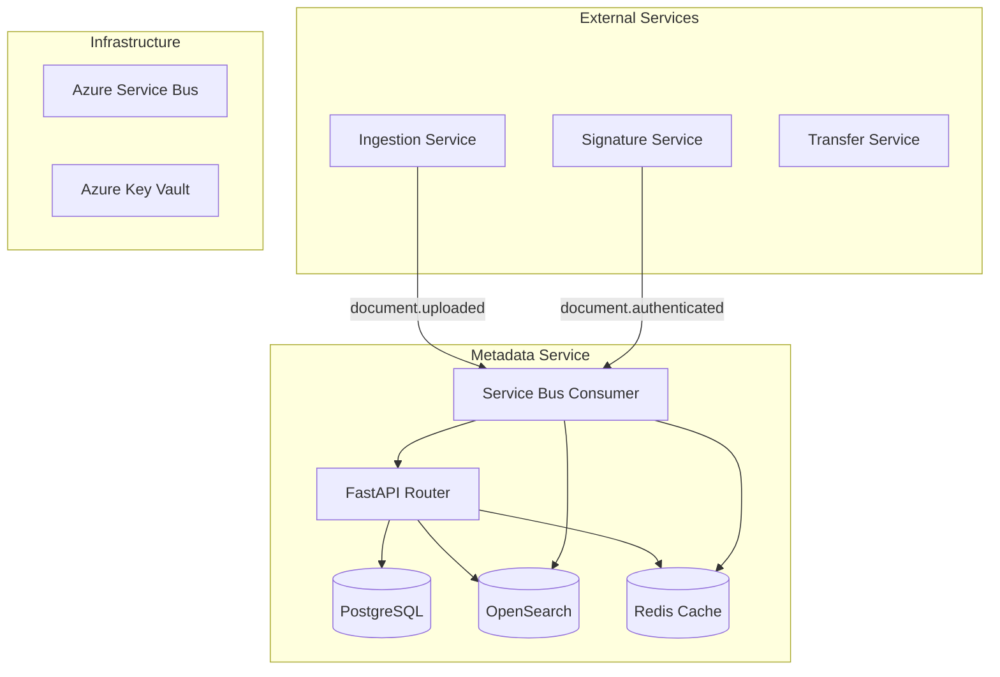

# Metadata Service - Carpeta Ciudadana

> **Servicio de metadatos y búsqueda de documentos** para el Operador Carpeta Ciudadana

## 📋 Resumen

El **Metadata Service** es un microservicio especializado en la gestión de metadatos de documentos y búsqueda avanzada utilizando **OpenSearch**. Proporciona capacidades de indexación, búsqueda full-text y cache inteligente para optimizar el rendimiento de consultas.

### 🎯 Propósito Principal

- **Indexación automática** de metadatos de documentos
- **Búsqueda full-text** con filtros avanzados
- **Cache inteligente** con invalidación automática
- **Integración event-driven** con Service Bus
- **Observabilidad completa** con métricas y trazas

---

## 🏗️ Arquitectura del Servicio

### Componentes Principales



### Tecnologías Utilizadas

| Componente | Tecnología | Propósito |
|------------|------------|-----------|
| **API Framework** | FastAPI | REST API con documentación automática |
| **Base de Datos** | Azure PostgreSQL | Almacenamiento persistente de metadatos (misma DB que ingestion) |
| **Motor de Búsqueda** | OpenSearch | Búsqueda full-text y filtros avanzados |
| **Cache** | Redis | Cache de consultas con TTL |
| **Mensajería** | Azure Service Bus | Eventos asíncronos |
| **ORM** | SQLAlchemy | Mapeo objeto-relacional |
| **Validación** | Pydantic | Schemas y validación de datos |
| **Driver DB** | psycopg | Driver optimizado para Azure PostgreSQL |

---

## 🚀 Casos de Uso

### CU-MD1: Indexación Automática de Documentos

**Descripción**: Indexar automáticamente metadatos de documentos cuando son subidos al sistema.

**Flujo**:
1. **Ingestion Service** sube documento → genera evento `document.uploaded`
2. **Metadata Service** consume evento del Service Bus
3. **DocumentIndexer** procesa el evento y extrae metadatos
4. **OpenSearch** indexa el documento para búsqueda
5. **Cache** se invalida para el ciudadano afectado

**Endpoints**:
- `POST /api/metadata/documents` - Crear metadatos manualmente
- Evento: `document.uploaded` (Service Bus)

**Datos Indexados**:
```json
{
  "documentId": "doc_12345",
  "citizenId": 1032236578,
  "title": "Certificado de Nacimiento",
  "filename": "cert_nacimiento.pdf",
  "hash": "sha256:abc123...",
  "contentType": "application/pdf",
  "status": "uploaded",
  "createdAt": "2025-01-11T10:30:00Z"
}
```

### CU-MD2: Búsqueda Avanzada de Documentos

**Descripción**: Permitir búsqueda full-text con filtros por ciudadano, tags, estado y paginación.

**Flujo**:
1. **Usuario** realiza consulta de búsqueda
2. **API** verifica cache Redis
3. Si **cache MISS**: consulta OpenSearch
4. **OpenSearch** ejecuta búsqueda con filtros
5. **Resultados** se cachean por 120 segundos
6. **Respuesta** con paginación y metadatos

**Endpoints**:
- `GET /api/metadata/search?q=certificado&citizen_id=1032236578&page=1&page_size=20`

**Parámetros de Búsqueda**:
- `q`: Texto libre (título, filename, tags)
- `citizen_id`: Filtrar por ciudadano específico
- `tags`: Tags separados por comas
- `status`: Estado del documento (uploaded, authenticated, etc.)
- `page`: Número de página (paginación)
- `page_size`: Tamaño de página (1-100)

**Respuesta**:
```json
{
  "total": 25,
  "page": 1,
  "page_size": 20,
  "results": [
    {
      "id": "doc_12345",
      "score": 0.95,
      "title": "Certificado de Nacimiento",
      "filename": "cert_nacimiento.pdf",
      "citizenId": 1032236578,
      "status": "authenticated",
      "createdAt": "2025-01-11T10:30:00Z"
    }
  ]
}
```

### CU-MD3: Actualización de Estado de Autenticación

**Descripción**: Actualizar el estado de autenticación de documentos cuando son verificados por el hub MinTIC.

**Flujo**:
1. **Signature Service** autentica documento → genera evento `document.authenticated`
2. **Metadata Service** consume evento
3. **OpenSearch** actualiza documento con estado de autenticación
4. **Cache** se invalida para el ciudadano

**Endpoints**:
- Evento: `document.authenticated` (Service Bus)

**Datos Actualizados**:
```json
{
  "hubAuthAt": "2025-01-11T11:00:00Z",
  "signatureStatus": "authenticated",
  "updatedAt": "2025-01-11T11:00:00Z"
}
```

### CU-MD4: Listado de Documentos por Ciudadano

**Descripción**: Obtener lista paginada de documentos de un ciudadano específico.

**Flujo**:
1. **Usuario** solicita documentos de un ciudadano
2. **API** consulta PostgreSQL directamente
3. **Filtros** por ciudadano y estado (no eliminados)
4. **Ordenamiento** por fecha de creación (más recientes primero)

**Endpoints**:
- `GET /api/metadata/documents?citizen_id=1032236578&limit=20&offset=0`

**Respuesta**:
```json
[
  {
    "id": "doc_12345",
    "citizen_id": 1032236578,
    "filename": "cert_nacimiento.pdf",
    "content_type": "application/pdf",
    "size_bytes": 245760,
    "status": "authenticated",
    "created_at": "2025-01-11T10:30:00Z"
  }
]
```

### CU-MD5: Eliminación de Documentos

**Descripción**: Eliminar documentos del índice de búsqueda (soft delete).

**Flujo**:
1. **Usuario** solicita eliminación de documento
2. **API** marca como eliminado en PostgreSQL
3. **OpenSearch** elimina documento del índice
4. **Cache** se invalida para el ciudadano

**Endpoints**:
- `DELETE /api/metadata/documents/{document_id}`

**Respuesta**:
```json
{
  "message": "Document deleted",
  "document_id": "doc_12345"
}
```

---

## 🔗 Integración con Azure PostgreSQL

### Base de Datos Compartida

El servicio **Metadata** utiliza la **misma base de datos Azure PostgreSQL** que el servicio **Ingestion**, garantizando:

- **Consistencia de datos** entre servicios
- **Modelos compartidos** con campos WORM y retención
- **Configuración unificada** para Azure PostgreSQL
- **Pool de conexiones optimizado** para Azure

### Campos WORM y Retención

El servicio Metadata ahora incluye los campos críticos para cumplimiento:

```sql
-- Campos WORM (Write Once Read Many)
state VARCHAR(20) DEFAULT 'UNSIGNED'  -- UNSIGNED | SIGNED
worm_locked BOOLEAN DEFAULT FALSE     -- Inmutabilidad
signed_at TIMESTAMP                   -- Fecha de firma
retention_until DATE                  -- Retención automática
hub_signature_ref VARCHAR(255)        -- Referencia del hub
legal_hold BOOLEAN DEFAULT FALSE      -- Retención legal
lifecycle_tier VARCHAR(20) DEFAULT 'Hot'  -- Hot | Cool | Archive
```

### Configuración Azure PostgreSQL

```python
# Configuración optimizada para Azure PostgreSQL
engine_config = {
    "pool_size": 5,
    "max_overflow": 10,
    "pool_pre_ping": True,
    "pool_recycle": 3600,
    "connect_args": {
        "sslmode": "require",
        "connect_timeout": 10,
        "application_name": "metadata-service"
    }
}
```

---

## 🔧 Configuración

### Variables de Entorno

```bash
# Database - Azure PostgreSQL (same as ingestion service)
DB_HOST=mock-postgres-host.database.azure.com
DB_PORT=5432
DB_NAME=carpeta_ciudadana
DB_USER=psqladmin
DB_PASSWORD=mock_password_123
DB_SSLMODE=require

# OpenSearch
OPENSEARCH_HOST=localhost
OPENSEARCH_PORT=9200
OPENSEARCH_USERNAME=admin
OPENSEARCH_PASSWORD=password
OPENSEARCH_USE_SSL=false

# Redis Cache
REDIS_HOST=localhost
REDIS_PORT=6379
REDIS_PASSWORD=

# Service Bus
SERVICEBUS_CONNECTION_STRING=Endpoint=sb://...

# Environment
ENVIRONMENT=development
CORS_ORIGINS=http://localhost:3000,http://localhost:8000
```

### Configuración de OpenSearch

El servicio crea automáticamente el índice `documents` con el siguiente mapeo:

```json
{
  "mappings": {
    "properties": {
      "documentId": {"type": "keyword"},
      "citizenId": {"type": "long"},
      "title": {
        "type": "text",
        "fields": {"keyword": {"type": "keyword"}}
      },
      "filename": {"type": "text"},
      "hash": {"type": "keyword"},
      "tags": {"type": "keyword"},
      "status": {"type": "keyword"},
      "contentType": {"type": "keyword"},
      "createdAt": {"type": "date"},
      "updatedAt": {"type": "date"},
      "hubAuthAt": {"type": "date"}
    }
  }
}
```

---

## 📊 Rendimiento y Cache

### Estrategia de Cache

- **TTL**: 120 segundos para resultados de búsqueda
- **Invalidación**: Automática por ciudadano usando Redis Pub/Sub
- **Claves**: `search:citizen:{citizen_id}:{hash}` y `search:global:{hash}`
- **Patrón**: Cache-Aside con invalidación inteligente

### Métricas de Rendimiento

| Métrica | Objetivo | Observación |
|---------|----------|-------------|
| **Latencia de búsqueda** | p50 ≤ 200ms, p95 ≤ 500ms | Cache HIT vs MISS |
| **Throughput** | 1000 RPS sostenido | Autoscaling con KEDA |
| **Disponibilidad** | 99.9% mensual | Health checks y circuit breakers |
| **Cache Hit Rate** | ≥ 80% | Optimización de TTL |

---

## 🔍 Observabilidad

### Health Checks

- `GET /health` - Estado del servicio
- `GET /ready` - Readiness para tráfico

### Métricas Clave

- **Búsquedas por segundo** (RPS)
- **Latencia de consultas** (p50, p95, p99)
- **Cache hit rate** por ciudadano
- **Errores de indexación** en OpenSearch
- **Tiempo de respuesta** de Service Bus

### Logs Estructurados

```json
{
  "timestamp": "2025-01-11T10:30:00Z",
  "level": "INFO",
  "service": "metadata",
  "operation": "search_documents",
  "citizen_id": 1032236578,
  "cache_hit": true,
  "response_time_ms": 45,
  "results_count": 15
}
```

### Manejo de Errores Azure

El servicio incluye **manejo de errores robusto** específico para servicios Azure:

#### **Azure PostgreSQL**
- ✅ **Conexión**: Detección de fallos de red y credenciales
- ✅ **SSL**: Validación de certificados y configuración SSL
- ✅ **Permisos**: Verificación de permisos de usuario
- ✅ **Timeouts**: Manejo de timeouts de conexión
- ✅ **Pool**: Gestión de pool de conexiones

#### **OpenSearch**
- ✅ **Conexión**: Detección de fallos de cluster
- ✅ **Índices**: Validación de existencia de índices
- ✅ **Permisos**: Verificación de permisos de indexación
- ✅ **Timeouts**: Manejo de timeouts de búsqueda
- ✅ **Queries**: Validación de sintaxis de consultas

#### **Redis Cache**
- ✅ **Conexión**: Detección de fallos de cluster
- ✅ **Permisos**: Verificación de permisos de cache
- ✅ **Timeouts**: Manejo de timeouts de cache
- ✅ **Invalidación**: Gestión de invalidación de cache

#### **Azure Service Bus**
- ✅ **Conexión**: Detección de fallos de namespace
- ✅ **Colas**: Validación de existencia de colas
- ✅ **Permisos**: Verificación de permisos de cola
- ✅ **Timeouts**: Manejo de timeouts de mensajería

#### **Códigos de Error HTTP**

| Código | Descripción | Servicio Azure |
|--------|-------------|----------------|
| `503` | Service Unavailable | PostgreSQL, OpenSearch, Redis |
| `403` | Forbidden | Permisos insuficientes |
| `504` | Gateway Timeout | Timeouts de conexión |
| `409` | Conflict | ID duplicado en PostgreSQL |
| `404` | Not Found | Documento no encontrado |

#### **Logs de Error Estructurados**

```json
{
  "timestamp": "2025-01-11T10:30:00Z",
  "level": "ERROR",
  "service": "metadata",
  "operation": "index_document",
  "error_type": "ConnectionError",
  "azure_service": "OpenSearch",
  "error_message": "Connection failed",
  "suggestion": "Check OpenSearch cluster availability",
  "document_id": "doc_12345",
  "citizen_id": 1032236578
}
```

---

## 🚀 Despliegue

### Docker

```dockerfile
FROM python:3.13-slim

WORKDIR /app
COPY pyproject.toml poetry.lock ./
RUN pip install poetry && poetry install --no-dev

COPY . .
CMD ["poetry", "run", "uvicorn", "app.main:app", "--host", "0.0.0.0", "--port", "8000"]
```

### Kubernetes

```yaml
apiVersion: apps/v1
kind: Deployment
metadata:
  name: metadata-service
spec:
  replicas: 3
  selector:
    matchLabels:
      app: metadata-service
  template:
    metadata:
      labels:
        app: metadata-service
    spec:
      containers:
      - name: metadata-service
        image: metadata-service:latest
        ports:
        - containerPort: 8000
        env:
        - name: DATABASE_URL
          valueFrom:
            secretKeyRef:
              name: metadata-secrets
              key: database-url
        - name: OPENSEARCH_HOST
          value: "opensearch-cluster"
        - name: REDIS_HOST
          value: "redis-cluster"
```

---

## 🧪 Testing

### Tests Unitarios

```bash
# Ejecutar tests
poetry run pytest tests/ -v

# Coverage
poetry run pytest --cov=app tests/

# Tests específicos
poetry run pytest tests/test_metadata_service.py::test_search_documents
```

### Tests de Integración

- **OpenSearch**: Verificar indexación y búsqueda
- **Redis**: Verificar cache y invalidación
- **Service Bus**: Verificar consumo de eventos
- **Database**: Verificar persistencia de metadatos

---

## 📚 API Reference

### Endpoints Principales

| Método | Endpoint | Descripción |
|--------|----------|-------------|
| `POST` | `/api/metadata/documents` | Crear metadatos de documento |
| `GET` | `/api/metadata/search` | Búsqueda avanzada |
| `GET` | `/api/metadata/documents` | Listar documentos |
| `DELETE` | `/api/metadata/documents/{id}` | Eliminar documento |
| `GET` | `/health` | Health check |
| `GET` | `/ready` | Readiness check |

### Schemas de Datos

#### DocumentMetadataCreate
```python
{
  "citizen_id": int,
  "title": str,
  "filename": str,
  "content_type": str,
  "size_bytes": int,
  "sha256_hash": str | None,
  "issuer": str | None,
  "tags": str | None,
  "description": str | None
}
```

#### DocumentSearchResponse
```python
{
  "total": int,
  "page": int,
  "page_size": int,
  "results": List[SearchResult]
}
```

---

## 🔗 Integración con Otros Servicios

### Eventos Consumidos

| Evento | Origen | Acción |
|---------|--------|--------|
| `document.uploaded` | Ingestion Service | Indexar documento en OpenSearch |
| `document.authenticated` | Signature Service | Actualizar estado de autenticación |

### Eventos Publicados

| Evento | Destino | Propósito |
|---------|---------|-----------|
| `cache.invalidated` | Redis Pub/Sub | Invalidar cache de búsqueda |

### Dependencias

- **PostgreSQL**: Metadatos persistentes
- **OpenSearch**: Motor de búsqueda
- **Redis**: Cache de consultas
- **Azure Service Bus**: Eventos asíncronos
- **Azure Key Vault**: Secretos y certificados

---

## 🛠️ Desarrollo

### Estructura del Proyecto

```
services/metadata/
├── app/
│   ├── __init__.py
│   ├── main.py                 # FastAPI application
│   ├── config.py              # Configuration
│   ├── database.py            # Database connection
│   ├── models.py              # SQLAlchemy models
│   ├── schemas.py             # Pydantic schemas
│   ├── opensearch_client.py   # OpenSearch client
│   ├── routers/
│   │   └── metadata.py         # API routes
│   └── consumers/
│       ├── event_consumer.py   # Service Bus consumer
│       └── document_indexer.py # Document indexer
├── tests/
│   ├── conftest.py
│   └── test_metadata_service.py
├── Dockerfile
├── pyproject.toml
└── README.md
```

### Comandos de Desarrollo

```bash
# Instalar dependencias
poetry install

# Ejecutar en desarrollo
poetry run uvicorn app.main:app --reload --host 0.0.0.0 --port 8000

# Ejecutar tests
poetry run pytest

# Linting
poetry run ruff check .

# Formatear código
poetry run ruff format .
```

---

## 📈 Roadmap

### Próximas Mejoras

- [ ] **Búsqueda semántica** con embeddings
- [ ] **Filtros avanzados** por fecha, tipo de documento
- [ ] **Sugerencias de búsqueda** (autocomplete)
- [ ] **Analytics** de búsquedas más populares
- [ ] **Backup y restore** de índices OpenSearch
- [ ] **Multi-tenant** para múltiples operadores

### Optimizaciones

- [ ] **Índices compuestos** en OpenSearch
- [ ] **Cache distribuido** con Redis Cluster
- [ ] **Compresión** de respuestas de búsqueda
- [ ] **CDN** para metadatos estáticos

---

## 📞 Soporte

Para soporte técnico o reportar issues:

- **Documentación**: [Wiki del proyecto](../../../README.md)
- **Issues**: GitHub Issues
- **Logs**: Azure Application Insights
- **Métricas**: Prometheus + Grafana

---

*Documento generado automáticamente - Metadata Service v0.1.0*
