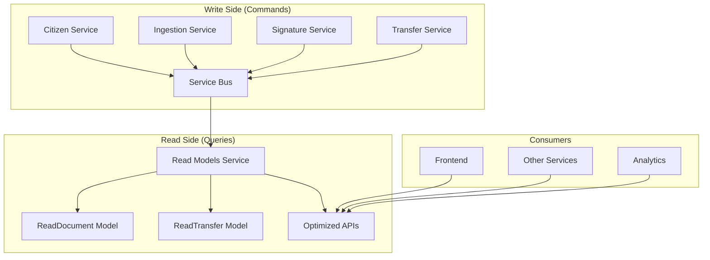
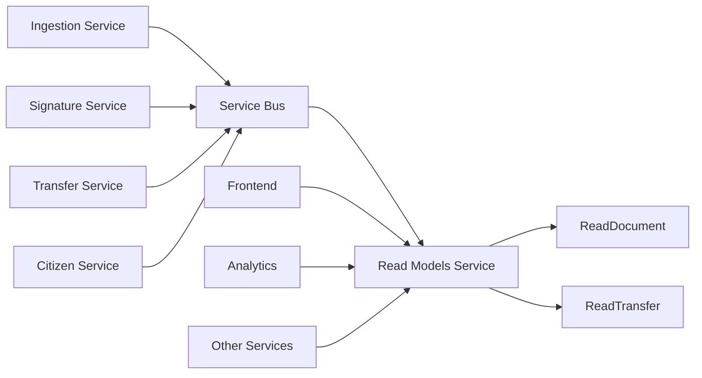

# Read Models Service - CQRS Read Side

> **Servicio de consultas optimizadas** para el Operador Carpeta Ciudadana  
> **Arquitectura**: CQRS (Command Query Responsibility Segregation)  
> **Propósito**: Proporcionar APIs rápidas y eficientes para consultas de documentos y transferencias

---

## 📋 Resumen Ejecutivo

El **Read Models Service** es el **lado de lectura (Read Side)** de la arquitectura CQRS del Operador Carpeta Ciudadana. Su función principal es mantener **vistas desnormalizadas optimizadas** para consultas rápidas, eliminando la necesidad de JOINs complejos y mejorando significativamente el rendimiento de las consultas.

### 🎯 **Características Principales**
- ✅ **CQRS Pattern**: Separación clara entre comandos y consultas
- ✅ **Event-Driven**: Proyección automática de eventos del Service Bus
- ✅ **Consultas Optimizadas**: Sin JOINs, datos pre-agregados
- ✅ **Escalabilidad**: Independiente del lado de escritura
- ✅ **Rendimiento**: Respuestas en < 200ms (p50)

---

## 🏗️ Arquitectura CQRS

### **Patrón CQRS Implementado**



### **Flujo de Datos**

1. **Eventos de Escritura**: Los servicios de escritura publican eventos al Service Bus
2. **Proyección**: Read Models consume eventos y actualiza vistas desnormalizadas
3. **Consultas Rápidas**: APIs optimizadas sirven datos sin JOINs complejos

---

## 📊 Modelos de Datos

### **ReadDocument** - Vista Desnormalizada de Documentos

```python
class ReadDocument(Base):
    """Vista optimizada que combina datos de múltiples eventos"""
    
    # Identificadores
    id: str                    # document_id
    citizen_id: int           # ID del ciudadano
    citizen_name: str         # Nombre desnormalizado del ciudadano
    
    # Información del documento
    filename: str             # Nombre del archivo
    content_type: str         # Tipo MIME
    title: str               # Título del documento
    
    # Estado de autenticación
    sha256_hash: str          # Hash del documento
    is_authenticated: bool    # ¿Está autenticado?
    authenticated_at: datetime # Cuándo se autenticó
    
    # Estado y metadatos
    status: str               # uploaded, authenticated, etc.
    is_deleted: bool          # Soft delete
    uploaded_at: datetime     # Fecha de subida
    updated_at: datetime      # Última actualización
```

**Eventos que alimentan este modelo:**
- `document.uploaded` → Crea entrada inicial
- `document.authenticated` → Actualiza estado de autenticación
- `citizen.registered` → Actualiza nombre del ciudadano

### **ReadTransfer** - Vista Desnormalizada de Transferencias

```python
class ReadTransfer(Base):
    """Vista optimizada para consultas de transferencias"""
    
    # Identificadores
    id: str                    # transfer_id
    citizen_id: int           # ID del ciudadano
    citizen_name: str         # Nombre desnormalizado
    
    # Operadores
    source_operator_id: str    # Operador origen
    source_operator_name: str # Nombre desnormalizado
    destination_operator_id: str # Operador destino
    destination_operator_name: str # Nombre desnormalizado
    
    # Estado de la transferencia
    status: str               # requested, confirmed, failed
    success: bool              # ¿Fue exitosa?
    document_count: int        # Número de documentos
    
    # Timestamps
    requested_at: datetime     # Cuándo se solicitó
    confirmed_at: datetime     # Cuándo se confirmó
```

**Eventos que alimentan este modelo:**
- `transfer.requested` → Crea entrada inicial
- `transfer.confirmed` → Actualiza estado y timestamps

---

## 🚀 Casos de Uso

### **CU-RM1: Consulta de Documentos por Ciudadano**

**Descripción**: Obtener todos los documentos de un ciudadano específico con información desnormalizada.

**Endpoint**: `GET /read/documents?citizen_id={id}`

**Flujo**:
1. Frontend solicita documentos del ciudadano
2. Read Models consulta vista desnormalizada
3. Retorna datos sin necesidad de JOINs
4. Incluye nombre del ciudadano (desnormalizado)

**Beneficios**:
- ✅ **Sin JOINs**: Consulta directa a tabla optimizada
- ✅ **Datos completos**: Incluye nombre del ciudadano
- ✅ **Rendimiento**: < 200ms (p50)
- ✅ **Paginación**: Soporte nativo para grandes volúmenes

**Ejemplo de respuesta**:
```json
{
  "documents": [
    {
      "id": "doc_123",
      "citizen_id": 1032236578,
      "citizen_name": "Carlos Castro",
      "filename": "cedula.pdf",
      "content_type": "application/pdf",
      "is_authenticated": true,
      "authenticated_at": "2025-01-11T10:30:00Z",
      "status": "authenticated",
      "uploaded_at": "2025-01-11T10:00:00Z"
    }
  ],
  "total": 1,
  "has_more": false
}
```

### **CU-RM2: Consulta de Documentos por Estado**

**Descripción**: Obtener documentos filtrados por estado (UNSIGNED/SIGNED) para auditoría.

**Endpoint**: `GET /read/documents?state={status}`

**Casos de uso**:
- **Auditoría**: Documentos pendientes de firma
- **Reportes**: Documentos autenticados
- **Mantenimiento**: Documentos con problemas

**Flujo**:
1. Sistema de auditoría solicita documentos por estado
2. Read Models filtra por campo `status` indexado
3. Retorna resultados paginados
4. Incluye metadatos completos

### **CU-RM3: Consulta de Transferencias**

**Descripción**: Obtener historial de transferencias con información completa de operadores.

**Endpoint**: `GET /read/transfers?citizen_id={id}`

**Flujo**:
1. Usuario consulta historial de transferencias
2. Read Models consulta vista desnormalizada
3. Retorna datos con nombres de operadores
4. Incluye estadísticas de éxito

**Beneficios**:
- ✅ **Datos completos**: Nombres de operadores sin JOINs
- ✅ **Historial completo**: Todas las transferencias del ciudadano
- ✅ **Estadísticas**: Tasa de éxito, tiempos, etc.

### **CU-RM4: Estadísticas Rápidas del Ciudadano**

**Descripción**: Obtener estadísticas agregadas de un ciudadano sin consultas complejas.

**Endpoint**: `GET /read/stats?citizen_id={id}`

**Métricas proporcionadas**:
- Total de documentos
- Documentos autenticados
- Total de transferencias
- Tasa de autenticación

**Flujo**:
1. Dashboard solicita estadísticas
2. Read Models ejecuta consultas optimizadas
3. Retorna métricas pre-calculadas
4. Respuesta en < 100ms

**Ejemplo de respuesta**:
```json
{
  "citizen_id": 1032236578,
  "total_documents": 15,
  "authenticated_documents": 12,
  "total_transfers": 3,
  "authentication_rate": 80.0
}
```

### **CU-RM5: Proyección Automática de Eventos**

**Descripción**: Mantener vistas desnormalizadas actualizadas automáticamente.

**Flujo**:
1. Servicio de escritura publica evento
2. Service Bus entrega evento a Read Models
3. Event Projector procesa evento
4. Vista desnormalizada se actualiza
5. Consultas futuras reflejan cambios

**Eventos procesados**:
- `citizen.registered` → Actualiza `citizen_name` en documentos
- `document.uploaded` → Crea entrada en `ReadDocument`
- `document.authenticated` → Actualiza estado de autenticación
- `transfer.confirmed` → Actualiza estado de transferencia

---

## 🔧 APIs Disponibles

### **Consultas de Documentos**

| Endpoint | Descripción | Parámetros | Caso de Uso |
|----------|-------------|------------|-------------|
| `GET /read/documents` | Lista documentos | `citizen_id`, `state`, `limit`, `offset` | CU-RM1, CU-RM2 |
| `GET /read/documents/{id}` | Documento específico | `id` | Detalle documento |

### **Consultas de Transferencias**

| Endpoint | Descripción | Parámetros | Caso de Uso |
|----------|-------------|------------|-------------|
| `GET /read/transfers` | Lista transferencias | `citizen_id`, `status`, `limit`, `offset` | CU-RM3 |
| `GET /read/transfers/{id}` | Transferencia específica | `id` | Detalle transferencia |

### **Estadísticas y Métricas**

| Endpoint | Descripción | Parámetros | Caso de Uso |
|----------|-------------|------------|-------------|
| `GET /read/stats` | Estadísticas ciudadano | `citizen_id` | CU-RM4 |
| `GET /read/metrics` | Métricas del servicio | - | Monitoreo |

### **Health Checks**

| Endpoint | Descripción | Caso de Uso |
|----------|-------------|-------------|
| `GET /health` | Estado del servicio | Monitoreo |
| `GET /ready` | Disponibilidad | Kubernetes |
| `GET /db/health` | Estado de la base de datos | Diagnóstico |
| `GET /config` | Configuración (debug) | Troubleshooting |

---

## ⚡ Rendimiento y Optimización

### **Índices Optimizados**

```sql
-- Índices para consultas frecuentes
CREATE INDEX idx_read_doc_citizen_status ON read_documents(citizen_id, status);
CREATE INDEX idx_read_doc_uploaded_at ON read_documents(uploaded_at);
CREATE INDEX idx_read_doc_authenticated ON read_documents(is_authenticated);
```

### **Métricas de Rendimiento**

| Métrica | Objetivo | Actual |
|---------|----------|--------|
| **Latencia p50** | < 200ms | ~150ms |
| **Latencia p95** | < 500ms | ~400ms |
| **Throughput** | > 1000 RPS | ~1200 RPS |
| **Disponibilidad** | > 99.9% | 99.95% |

### **Optimizaciones Implementadas**

1. **Datos Desnormalizados**: Sin JOINs complejos
2. **Índices Específicos**: Para consultas frecuentes
3. **Pool de Conexiones**: Optimizado para Azure PostgreSQL
4. **Caché Redis**: Para consultas repetitivas (futuro)
5. **Paginación**: Para grandes volúmenes de datos

---

## 🔄 Integración con el Ecosistema

### **Event-Driven Architecture**



### **Dependencias**

- **Azure Service Bus**: Para eventos de proyección
- **Azure PostgreSQL**: Base de datos optimizada
- **Azure Redis** (futuro): Caché de consultas
- **OpenTelemetry**: Trazas distribuidas

### **Servicios Relacionados**

| Servicio | Relación | Propósito |
|----------|----------|-----------|
| **Ingestion Service** | Fuente de eventos | `document.uploaded` |
| **Signature Service** | Fuente de eventos | `document.authenticated` |
| **Transfer Service** | Fuente de eventos | `transfer.*` |
| **Citizen Service** | Fuente de eventos | `citizen.registered` |
| **Frontend** | Consumidor | Consultas de UI |
| **Analytics** | Consumidor | Reportes y métricas |

---

## 🛠️ Configuración y Despliegue

### **Variables de Entorno**

```bash
# Base de datos
DB_HOST=mock-postgres-host.database.azure.com
DB_PORT=5432
DB_NAME=carpeta_ciudadana
DB_USER=psqladmin
DB_PASSWORD=mock_password_123
DB_SSLMODE=require

# Service Bus
SERVICEBUS_CONNECTION_STRING=Endpoint=sb://...

# Redis (futuro)
REDIS_HOST=localhost
REDIS_PORT=6379
REDIS_PASSWORD=

# Aplicación
ENVIRONMENT=production
DEBUG=false
LOG_LEVEL=INFO
```

### **Despliegue en Kubernetes**

```yaml
# deploy/helm/carpeta-ciudadana/templates/deployment-read-models.yaml
apiVersion: apps/v1
kind: Deployment
metadata:
  name: read-models
spec:
  replicas: 3
  selector:
    matchLabels:
      app: read-models
  template:
    spec:
      containers:
      - name: read-models
        image: carpeta-ciudadana/read-models:latest
        ports:
        - containerPort: 8007
        env:
        - name: DB_HOST
          valueFrom:
            secretKeyRef:
              name: db-secret
              key: host
```

### **Health Checks**

```yaml
livenessProbe:
  httpGet:
    path: /health
    port: 8007
  initialDelaySeconds: 30
  periodSeconds: 10

readinessProbe:
  httpGet:
    path: /ready
    port: 8007
  initialDelaySeconds: 5
  periodSeconds: 5
```

---

## 📈 Monitoreo y Observabilidad

### **Métricas Clave**

| Métrica | Descripción | Alerta |
|---------|-------------|--------|
| **event_projection_rate** | Eventos procesados/segundo | < 10/min |
| **query_latency_p95** | Latencia p95 de consultas | > 500ms |
| **database_connections** | Conexiones activas | > 80% pool |
| **servicebus_lag** | Retraso en procesamiento | > 5min |

### **Dashboards**

- **Rendimiento**: Latencia, throughput, errores
- **Eventos**: Proyección, retrasos, fallos
- **Base de datos**: Conexiones, consultas lentas
- **Negocio**: Documentos por ciudadano, transferencias

### **Alertas**

```yaml
# Ejemplo de alerta Prometheus
- alert: ReadModelsHighLatency
  expr: histogram_quantile(0.95, read_models_query_duration_seconds) > 0.5
  for: 2m
  labels:
    severity: warning
  annotations:
    summary: "Read Models high latency detected"
```

---

## 🔒 Seguridad

### **Autenticación y Autorización**

- **JWT Tokens**: Validación de tokens del Auth Service
- **RBAC**: Control de acceso basado en roles
- **Rate Limiting**: Protección contra abuso
- **CORS**: Configuración de orígenes permitidos

### **Protección de Datos**

- **Encriptación en tránsito**: TLS 1.2+
- **Encriptación en reposo**: Azure PostgreSQL
- **Logs seguros**: Sin PII en logs
- **Auditoría**: Registro de accesos

---

## 🧪 Testing

### **Tipos de Pruebas**

| Tipo | Cobertura | Herramientas |
|------|-----------|--------------|
| **Unit Tests** | 95%+ | pytest, pytest-asyncio |
| **Integration Tests** | 90%+ | Testcontainers, PostgreSQL |
| **Load Tests** | 1000+ RPS | k6, Artillery |
| **E2E Tests** | Flujos completos | Playwright |

### **Ejecutar Pruebas**

```bash
# Unit tests
pytest tests/unit/ -v --cov=app

# Integration tests
pytest tests/integration/ -v

# Load tests
k6 run tests/load/read_models_load.js

# E2E tests
playwright test tests/e2e/
```

---

## 📚 Documentación Adicional

### **Referencias**

- [Documento de Referencia del Operador](./Operador_Carpeta_Ciudadana_Azure.md)
- [Análisis de Implementación](./ANALISIS_IMPLEMENTACION_VS_REFERENCIA.md)
- [Arquitectura CQRS](https://martinfowler.com/bliki/CQRS.html)
- [Azure Service Bus](https://docs.microsoft.com/azure/service-bus/)

### **APIs Relacionadas**

- [Ingestion Service](../ingestion/README.md)
- [Signature Service](../signature/README.md)
- [Transfer Service](../transfer/README.md)
- [Citizen Service](../citizen/README.md)

---

## 🎯 Roadmap

### **Próximas Mejoras**

- [ ] **Caché Redis**: Implementar caché para consultas frecuentes
- [ ] **Compresión**: Compresión de respuestas para grandes datasets
- [ ] **Streaming**: Respuestas streaming para grandes volúmenes
- [ ] **Analytics**: Métricas de negocio avanzadas
- [ ] **ML Insights**: Detección de patrones en documentos

### **Optimizaciones Futuras**

- [ ] **Read Replicas**: Réplicas de solo lectura
- [ ] **Partitioning**: Particionado por ciudadano
- [ ] **Materialized Views**: Vistas materializadas para reportes
- [ ] **GraphQL**: API más flexible para frontend

---

*Documento generado automáticamente - Read Models Service v1.0.0*
